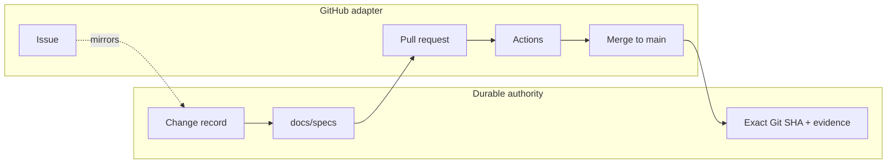
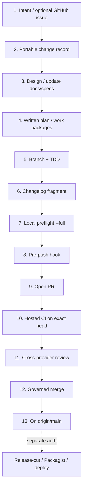

# Issue → merge: Waaseyaa development workflow

Operator map of how substantive work moves from intent to `origin/main`.
Canonical contracts remain [`docs/specs/workflow.md`](../specs/workflow.md) and
[`docs/specs/governed-gates.md`](../specs/governed-gates.md). This page is the
end-to-end picture those specs assume.

**Read date:** 2026-09-04.

## Authority model (read this first)

| Surface | Owns | Role |
|---------|------|------|
| Portable change record (`docs/change-records/`) | Scope, decisions, work packages | **Authority** |
| `docs/specs/` + ADRs | Enduring subsystem contracts | **Authority** |
| Exact Git objects + verification evidence | Candidate SHA, locks, results | **Authority** |
| GitHub issue / PR | Discussion, CI adapter, merge mechanics | Adapter |
| Agent `@claude` / `@codex` review | Advisory findings bound to head SHA | Evidence only |
| Release-cut / Packagist / app deploy | Tag, split, promotion | **Separate authorization** |

GitHub is the current forge adapter. Losing GitHub must not lose the audit trail.



## End-to-end pipeline



| # | Stage | Owner | Must complete before next |
|---|-------|-------|---------------------------|
| 1 | Intent / optional issue | Maintainer | Problem stated; issue is a mirror only |
| 2 | Portable change record | Author | `docs/change-records/<ID>.md` with scope + work packages |
| 3 | Design / spec | Author | Spec updated, or conforming `spec-reviewed:` trailer |
| 4 | Written plan | Author | One review candidate per work package |
| 5 | Branch + TDD | Author / agent | Failing test first; no `git stash`; use `bin/git` |
| 6 | Changelog fragment | Author | `changes/unreleased/<issue>.<slice>.<type>.md` |
| 7 | Local preflight | Author | `php bin/check-pr-preflight --full` |
| 8 | Pre-push hook | Hooks | Default preflight blocks push |
| 9 | Open PR | Author | `Closes #N` or `Part of #N`; title includes `#N` |
| 10 | Hosted CI | Actions | Required checks green on exact PR head |
| 11 | Cross-provider review | Maintainer | `@claude` or `@codex` review (advisory) |
| 12 | Governed merge | Auto-merge / maintainer | `auto-merge-when-green` + milestone + green checks |
| 13 | On `main` | Publication | Candidate published; release still separately authorized |

## The four workflow rules

From [`docs/specs/workflow.md`](../specs/workflow.md):

1. **Design + change record first** — multi-step work starts with a design and a stable portable change record, not a blank prompt or an issue number.
2. **Forge issues are mirrors** — GitHub issues are optional discovery surfaces.
3. **Review candidates are traceable** — every PR binds change-record ID, parent/candidate commits, and verification evidence. `Closes #N` is adapter sugar.
4. **Read context before generating** — re-read the change record, decision trail, and relevant specs before continuing an effort.

Design-first loop (compressed):

```text
Brainstorm → Spec → Plan → Failing test → Implement → Preflight --full → PR + CI → Review evidence → Governed merge
```

## Local verification vs hosted CI

Preflight exists so long CI jobs never discover what the fast half could have said in seconds. The Architecture suite runs inside CI’s `ci/unit-tests` surface — forgetting it locally caused the #2399 five-red-jobs surprise.

| Concern | Local | Hosted | Enforcement |
|---------|-------|--------|-------------|
| Preflight (default) | `php bin/check-pr-preflight` | Pre-push + many CI jobs | Blocking |
| Preflight `--full` | phpstan + dead-code | `ci/lint`, `check-dead-code` | Pre-PR local; CI always |
| Unit / Integration / Architecture | Split PHPUnit suites | `ci/unit-tests` (+ shards) | Required evidence |
| Spec drift | `tools/drift-detector.sh` | `spec-drift` job | Blocking both sides |
| Random-order proof | Optional locally | `ci/random-order` | Required context |
| Playwright smoke | Optional admin e2e | `ci/playwright-smoke` | Required context |
| FrankenPHP worker | Not a laptop skip | `ci/frankenphp-worker` | Hosted lane |

### Preflight inventory (41 gates)

Roster is data in `tools/preflight-gates.json` (asserted by `PreflightParityTest`). Default profile ≈ 39 gates; `--full` adds phpstan and dead-code.

| Group | Examples |
|-------|----------|
| Composer & layers | composer policy, portable paths, package layers, symfony imports, distribution extensions |
| S1 / support contracts | support contract, sqlite construction, config activation/authority, schema authority |
| Security & access | no secrets, governed secret access, runtime-policy custody, access hardening, getquery bindings, field guards |
| Release note hygiene | changelog shape, fragments, discipline, release publish shape |
| Admin & surfaces | admin coercion, admin dist freshness/manifest, surface parity, openapi |
| Quality engines | `cs-check` (default); phpstan + dead-code (`--full`) |

Repair stale recorded artifacts with:

```bash
php bin/refresh-governance-artifacts
```

## PR checklist

From `.github/pull_request_template.md`, plus governance extras:

1. `Closes #N` or `Part of #N` (multi-PR efforts use Part of on the anchor).
2. Title includes `#N` (e.g. `feat(#1920): …`); dependency-only PRs may omit when no tracking issue.
3. Validated `changes/unreleased/<issue>.<slice>.<type>.md`, or document `no-changelog: <reason>`.
4. Portable change-record ID + exact parent/candidate commits (substantive work).
5. `php bin/check-pr-preflight --full` + Unit / Integration / Architecture green on the exact head.
6. Spec updates, or conforming `spec-reviewed: docs/specs/<name>.md - <reason>` trailer.
7. Milestone assigned if using `auto-merge-when-green`.

## Merge path

Label `auto-merge-when-green` → squash merge when:

- every status check required by the live `main-protection` ruleset passes on the exact head
- PR is open with no merge conflicts
- PR has a milestone assigned

Workflow: `.github/workflows/auto-merge.yml`. Query live ruleset state — do not hard-code a required-check count.

Never merge to `main` while a release split / fan-out is running. Never `git stash`.

Cross-provider review (`.github/MANUAL_REVIEWS.md`): Codex-authored → `@claude review`; Claude-authored → `@codex review`. Agent review is evidence, not human approval or a required check.

## After merge (separate authorization)

Merge proves the framework candidate through CI. It does **not** authorize:

- tag / `release-cut.yml`
- split-mirror / Packagist publish
- application staging or production deploy

Cut a release separately:

```bash
gh workflow run release-cut.yml -f version=v0.1.0-alpha.N
```

The cut requires green CI on the release base and on the exact gate-branch commit before tagging.

## Key commands

```bash
# Fast gates (also pre-push)
php bin/check-pr-preflight

# Documented pre-PR command
php bin/check-pr-preflight --full

# Repair stale governance artifacts
php bin/refresh-governance-artifacts

# Split suites (do not run bare phpunit — OOM risk)
php -d memory_limit=1G ./vendor/bin/phpunit --testsuite Unit --no-coverage
./vendor/bin/phpunit --testsuite Integration --no-coverage
./vendor/bin/phpunit --testsuite Architecture --no-coverage

# Hooks
composer hooks:install
composer hooks:doctor
```

## Common footguns

- Skipping the Architecture suite locally
- Treating GitHub milestones / issue numbers as execution authority
- Hand-editing root `CHANGELOG.md` Unreleased into a release section (fragments only; release-cut compiles)
- Merging during split fan-out
- Assuming merge equals a Packagist tag
- Using `git stash`
- Relying on a documented required-check count instead of the live `main-protection` ruleset

## Canonical doc map

| Doc | Role |
|-----|------|
| [`docs/specs/workflow.md`](../specs/workflow.md) | Forge-neutral workflow + 4 rules |
| [`docs/specs/governed-gates.md`](../specs/governed-gates.md) | Preflight, refresh, pre-push parity |
| [`docs/governance/agent-contract.md`](../governance/agent-contract.md) | Cross-agent authorization + evidence |
| [`docs/ci/README.md`](../ci/README.md) | CI surfaces + auto-merge label |
| [`.github/pull_request_template.md`](../../.github/pull_request_template.md) | PR traceability checklist |
| [`.github/MANUAL_REVIEWS.md`](../../.github/MANUAL_REVIEWS.md) | Cross-provider review protocol |
| [`docs/governance/m11-steady-state-conformance-loop.md`](../governance/m11-steady-state-conformance-loop.md) | Governed-change intake + drift backstop |
| `CLAUDE.md` / `AGENTS.md` | Harness adapters (must not weaken the contract) |

## Spec impact

This cookbook is a projection of existing contracts. It does not change merge,
release, or gate behavior. When those contracts change, update this page in the
same change set (or leave a `spec-reviewed:` trailer on the cookbook if you
intentionally defer the projection).
