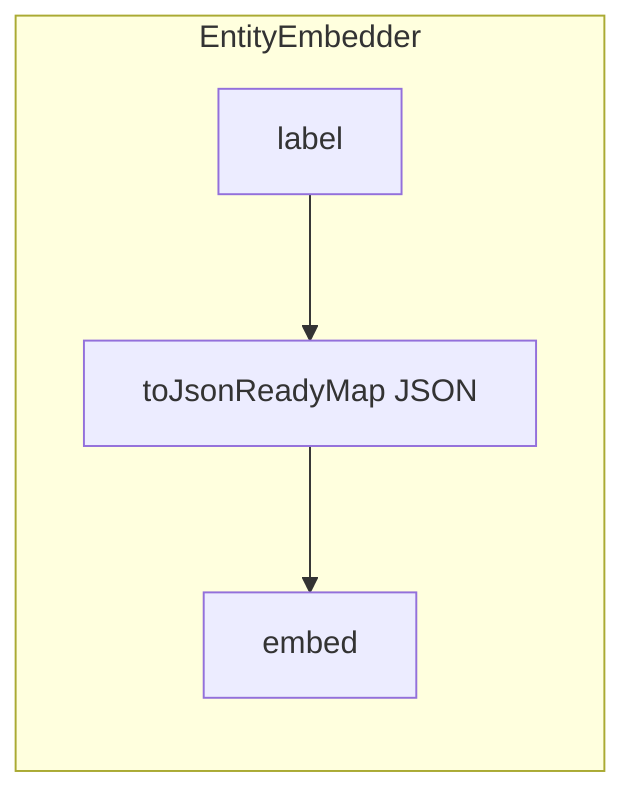

# AI Integration

<!-- Spec reviewed 2026-08-30 - #2657: `waaseyaa/ai-tools` gains two
namespaces that are library code only — no service provider, no route, no
attribute, no discovery convention. `Dispatch/` holds `ToolDispatcherInterface`
and `AgentToolDispatcher`, the schema-enforcing, exception-sanitizing,
audit-stage-classifying dispatch path lifted verbatim out of
`Waaseyaa\Mcp\Bridge\AgentToolRegistryBridge` (which now delegates to it), plus
`AuditedToolDispatcher`, a reserve-before-side-effect decorator that refuses to
construct on an absent or record-nothing `StrictAuditLedgerInterface` and takes
its audit surface and correlation id from the calling transport. Every path out
of its `dispatch()` is either durably recorded or answered with
`AUDIT_TRAIL_UNAVAILABLE`: caller-supplied tool names are projected through
`auditOperation()` so the strict ledger always receives a non-empty bounded
operation (a blank name becomes `tool_name_unusable` with the raw value kept in
`metadata`), and a terminal refusal the ledger rejects is refused to the caller
rather than answered as an ordinary lookup miss. `Registry/`
holds the shared `CapabilityScopedToolRegistry` the MCP tier now delegates to,
and `ToolIdAllowlistRegistry`, an exact-membership narrowing decorator for
ADR-022 D-7 closed-list local profile. Tool authorization is unchanged:
`AbstractAgentTool::requireCapability()` remains the only authorization layer
and the registries only decide visibility. -->

<!-- Spec reviewed 2026-08-27 - #2544: `EntityFieldRedaction::ALWAYS_INTERNAL_FIELDS` gains `legacy_pass`, so an imported credential pending upgrade is redacted from agent-tool output exactly like `pass`. -->

<!-- Spec reviewed 2026-08-27 - #2624: McpServiceProvider's development-only
NullConfigStorage fallback is classified by the boot-scoped RuntimePolicy.
Invalid explicit environment configuration is production-like and cannot fall
through to APP_ENV or enable the fallback. A missing profile is also
production-like: only RuntimePolicy::isExplicitDevelopment() can enable this
fallback. -->

<!-- Spec reviewed 2026-08-25 - #2520: `entity.read` / `entity.search` map
WP4 `FieldReadDenied` to per-field omission at the tool boundary (JSON:API
parity), not `INTERNAL_ERROR` and not a distinguishable field-forbidden
error. R8-c not-found for absent vs view-forbidden entities is unchanged.
See docs/specs/mcp-endpoint.md. -->

<!-- Spec reviewed 2026-08-20 - #2464: EntityRollbackTool and
EntitySetCurrentRevisionTool keep EntityRevisionRestoreGuard as the AI-facing
wrapper; the changed-field set is RevisionRestoreChangedFields so Admin and AI
restore cannot drift. Workflow/publication fields remain material; credentials
do not. -->
<!-- Spec reviewed 2026-08-08 - Anokii boundary remediation: framework-owned AI agent entities are registered from their class attributes so declared entity and field metadata survives provider bootstrap. This changes provider construction only; agent execution, tool authorization, and MCP exposure contracts are unchanged. -->

<!-- Spec reviewed 2026-08-05 - #2194: ai-tools owns the optional `content.search` adapter and tool. It resolves the search package only through the provider boundary, requires an `AuthorizationPrincipalInterface`, emits a bounded schema and closed result projection, and converts missing or failing optional infrastructure to the shared sanitized correlation-only error contract. Anonymous MCP exposure remains default-off and adds only the dedicated `tool.content.search` capability when explicitly enabled. -->
<!-- Spec reviewed 2026-08-05 - #2216: `AgentToolInterface::execute()` and `dryRun()`, plus `AgentExecutor`, now require `AuthorizationPrincipalInterface` so agent entry points cannot accept identity objects that lack the framework's immutable authorization-claims contract. Existing tool implementations may retain the wider `AccountInterface` parameter through PHP contravariance. MCP authentication providers and the registry bridge use the same principal contract end to end. -->
<!-- Spec reviewed 2026-08-04 - #2200: ai-schema ships only EntityJsonSchemaGenerator and has no current agent-runtime or MCP consumer. Retired the nonexistent McpToolDefinition, McpToolGenerator, TranslationToolGenerator, McpToolExecutor, and SchemaRegistry surfaces and the fictional accessCheck(false) path. Agent tools own and validate their declared schemas in ai-tools; MCP transports those descriptors without an ai-schema dependency. -->
<!-- Spec reviewed 2026-08-04 - #2191: the legacy McpController discovery blend, search aliases, and stable-meta claims are explicitly retired; new remote search must use the canonical access-checked agent-tool lifecycle. -->

<!-- Spec reviewed 2026-08-15 - S1-FW-CFG-04 (governed secret custody): outbound MCP and the LLM/embedding providers moved from raw string credential reads to typed SecretReference custody through the frozen kernel SecretResolverRegistry — providers hold a SecretHandle and resolve a fresh version per outbound request inside a registered consumer (McpCredentialOperation, AnthropicCredentialOperation, OpenAiCompatibleCredentialOperation, OpenAiEmbeddingCredentialOperation); credential bytes never cross the operation boundary, and outcome objects (ProviderCredentialOutcome, McpCredentialOutcome) discard original exception text. Every MCP server row now declares auth_mode (none|secret-reference) and availability (required|optional): an optional server's startup/call failure records degraded McpIntegrationHealth and yields no tools; a REQUIRED server's failure throws McpReadinessException and blocks boot — this supersedes the 2026-07-13 "an unavailable server cannot abort kernel boot" claim for required servers. Remote JSON-RPC errors surface as the fixed McpRemoteErrorException signal; tool-call errors are the fixed envelopes mcp_credential_unavailable / mcp_server_unavailable / mcp_remote_error (no detail text). Custody mechanics: docs/specs/infrastructure.md; MCP tool-source contract and ai.providers/ai.mcp_servers schema v2: docs/specs/agent-executor.md; policy: docs/specs/security-defaults.md. -->

<!-- Spec reviewed 2026-08-03 - #2177 F1 slice B: `AgentTool::toMcpDescriptor()` now always emits the spec-standard MCP `annotations.destructiveHint`, projected from the tool's declared `$destructive`. It is advisory display metadata for MCP clients; server-side enforcement (the write tier's human-approval gate, see docs/specs/mcp-endpoint.md §"Human-approval gate") reads `$destructive` itself and never the hint. On a gated endpoint the MCP layer additionally decorates destructive tools' tools/list descriptors with `_meta["ai.waaseyaa.mcp/approval"]="required"` — that decoration lives in `McpEndpoint`, not in AgentTool. Acceptance: AgentToolDescriptorTest. -->

<!-- Spec reviewed 2026-08-03 - #2177 F6 (mcp-public-boundary): the 11 generic `catch (\Throwable)` arms across the entity/relationship/vector tools no longer embed `$e->getMessage()` in the returned AgentToolResult (nor in its `summary`, the audit/transcript line) — they call `AbstractAgentTool::internalError()`, which returns a fixed INTERNAL_ERROR envelope plus a random correlation id via the new `Waaseyaa\AI\Tools\Error\SanitizedToolError`. The logger (attached at hydration by AttributeToolRegistry, mirroring the EntityAccessHandler mechanism) receives safe diagnostic METADATA only — correlation id, tool, exception class, file, line, integer code — never the message, trace, or the Throwable object. Typed domain catches (validation, revision conflict, key refusal, not-revisionable, forbidden) are untouched and remain machine-readable. See the new "Tool failure contract" section. -->

<!-- Spec reviewed 2026-07-13 - R18 M6 (#1975): the outbound MCP subsystem is active production wiring, not parked scaffolding. `Waaseyaa\AI\Agent\Mcp\McpServiceProvider` is declared in `packages/ai-agent/composer.json` under `extra.waaseyaa.providers`, so normal package-manifest compilation boots remote tool discovery. Its existing fail-closed contract is unchanged: no host tool registry/config means no remote tools, and an unavailable server cannot abort kernel boot. Acceptance: McpServiceProviderManifestTest. -->
<!-- Spec reviewed 2026-07-13 - CW-v1 option-1 PR-4 (#1920, security): EntityKeyGuard's LITERAL_FLOOR gains `revision_id`/`published_revision_id` — a collateral finding while adding the JSON:API write-side field allowlist (`docs/specs/api-layer.md` "Write-side field allowlist"): `published_revision_id` was NOT already refused by this guard (empirically confirmed red, no entity-key kind names it), so `entity.update`/`entity.create` could silently write it despite the class-level "identity fields cannot be written through this tool" contract. See updated "Refusal set" below. -->
<!-- Spec reviewed 2026-07-06 - audit-remediation batch B3 (ai-vector unbound provider): packages/ai-vector shipped NO ServiceProvider and its composer.json extra had no waaseyaa key, so EmbeddingStorageInterface was unbound. The semantic:warm / semantic:refresh CLI handlers (each taking SemanticIndexWarmer) were autowired by KernelHandlerContainer, hit the interface param, and threw No binding for "Waaseyaa\AI\Vector\EmbeddingStorageInterface", crashing both documented commands. Fixed by a new AiVectorServiceProvider (registered via extra.waaseyaa.providers) binding EmbeddingStorageInterface -> SqliteEmbeddingStorage (\PDO from the kernel bus, table embeddings) and SemanticIndexWarmer DIRECTLY (its nullable ?EmbeddingProviderInterface cannot be reflection-autowired); with no ai.embedding_provider configured the warmer reports skipped_no_provider (graceful degrade). EmbeddingProviderInterface is bound only when configured (fromConfig returns null otherwise), which also lets a host-wired vector.search tool resolve a real provider off the bus (the tool in waaseyaa/ai-tools duck-types these interfaces via \Closure resolvers by design; binding the interfaces is the ai-vector-side enablement, closure-wiring stays a host concern). Separately, EntityEmbedder::searchSimilar() now REQUIRES an AccountInterface and filters fail-closed (load-then-check view via EntityAccessHandler), closing a dormant access-unfiltered leak (zero production callers; SearchController and VectorSearchTool both bypass EntityEmbedder). See the EntityEmbedder section for the updated signature. Pinned by AiVectorServiceProviderTest, EntityEmbedderTest, VectorSearchIntegrationTest. -->
<!-- Spec reviewed 2026-07-05 - audit-remediation batch R8 WP2 (security, audit R8-c): `RelationshipTraverseTool` (`relationship.traverse`, `packages/ai-tools/src/Relationship/RelationshipTraverseTool.php`) gated only the edge row (`canViewEntity($row)`) and the FAR endpoint (`canViewEndpoint()` on `to_entity_type`/`to_entity_id`) but NEVER the SOURCE entity's own view access — a code comment rationalized "the source is the caller's own query input, so its visibility is implied", the confused-deputy/existence-oracle pattern. `tool.relationship.traverse` is on `PublicAnonymousAuth::DEFAULT_READ_CAPABILITIES`, so an anonymous MCP caller could supply `source_id` = a restricted node and, if it had any published edge to a viewable entity, receive a non-empty `edges` array echoing the restricted source id — confirming the entity exists and has that relationship (the same disclosure the HTTP `DiscoveryRouter` hub/cluster/timeline gate closes; see docs/specs/api-layer.md). Fixed with a new fail-closed `RelationshipTraverseTool::canViewSource()` (mirrors the existing `canViewEndpoint()`: unknown type / unloadable / policy-denied → not viewable; capability-only mode allows, enforced-with-no-handler fails closed) run BEFORE querying edges; when the source is not viewable the tool returns an EMPTY result (`edges: [], count: 0`) via `emptyTraversalResult()`, INDISTINGUISHABLE from "source has no relationships" / "source absent". The stale endpoint-gate comment was updated to state the source is now gated up front. Acceptance: `RelationshipTraverseAccessFilterTest::traverse_returns_empty_when_the_source_entity_is_view_forbidden`, `::forbidden_source_is_indistinguishable_from_an_absent_source`, `::traverse_returns_the_edge_when_the_source_entity_is_viewable` (positive control); the three pre-existing edge/endpoint tests now seed a viewable source so they exercise the filter they are about. This closes the source-existence-oracle class on the MCP surface, completing the HTTP-surface fix in the same batch. ALSO in this batch, the absent-vs-forbidden form of the same oracle was closed on `EntityReadTool` (`entity.read`) and `EntityListRevisionsTool` (`entity.list_revisions`) — both on the anonymous read tier via `tool.entity.read`. They returned a distinguishable "not permitted to view" (from `requireEntityAccess()`) for an existing-but-forbidden id vs "not found" for an absent id; both now collapse the absent and view-forbidden outcomes into the IDENTICAL `... not found` error via `$entity === null || !$this->canViewEntity($entity, $account)` (the shared `requireEntityAccess()` is UNCHANGED — the destructive write tools off the anonymous tier keep their 'forbidden' message). A viewable entity still returns its data/revisions. Acceptance: `EntityReadOracleClosureTest`. With this, the anonymous MCP read tier (`entity.read`, `entity.search`, `relationship.traverse`, `bimaaji.read`) is free of entity-existence oracles — `entity.search` already filters forbidden hits silently, `bimaaji.read` is not id-scoped. -->
<!-- Spec reviewed 2026-07-03 - audit-remediation batch R4 PR3 (ai-agent M1): closed a cross-account trail-overwrite hole in the Wayfinding write tools. `EditTrailTool` (packages/ai-agent/src/Tool/Wayfinding/EditTrailTool.php:90, `TrailStore::editAsHuman()`) and `ReRecordTrailTool` (ReRecordTrailTool.php:~87, `TrailStore::reRecord()`) gated only the coarse `present guided content` capability before writing to whatever `trail_id` was supplied — but `TrailAccessPolicy::access()` (packages/wayfinding/src/Access/TrailAccessPolicy.php) routes `update` owner-only, so any capability holder could edit or re-record ANOTHER account's trail, bypassing that owner-only policy entirely. Fixed by a shared `AbstractTrailTool::requireTrailUpdateAccess()` helper that loads the trail (mirroring `TrailStore::resolveOwner()`'s language-then-default fallback) and calls `requireEntityAccess($trail, 'update', $account)` (fail-closed) BEFORE the store() write, in both tools' `execute()`. `RecordTrailTool` (creates a trail self-attributing ownership to the caller) and `GetTrailTool` (view policy is owner-OR-capability-holder, matching its existing capability-only gate) were swept and confirmed already correct — no change needed. Acceptance: `WayfindingTrailToolsTest::edit_is_forbidden_for_a_non_owner_even_with_the_capability`, `::rerecord_is_forbidden_for_a_non_owner_even_with_the_capability`, `::edit_and_rerecord_still_work_for_the_owner_with_a_real_handler_attached`. -->
<!-- Spec reviewed 2026-06-21 - M77 flagship (#1705 / CL-8): ai-agent gains a FIFTH `#[AsAgentTool]` Wayfinding adapter `wayfinding_edit_trail` (packages/ai-agent/src/Tool/Wayfinding/EditTrailTool.php), destructive:true + `present guided content` capability, mirroring ReRecordTrailTool but routing to `TrailStore::editAsHuman()` (advances the live value AND latches origin=human). This is the authenticated app surface that was missing: editAsHuman() previously had no MCP/HTTP/admin/CLI caller, so the flagship "human edits are never overwritten" guarantee (SC-005) was demonstrable only from a unit test reaching around the tool layer. Attribute-discovered (no service-provider wiring). Acceptance: WayfindingTrailToolsTest::editing_as_human_via_the_tool_latches_origin_and_survives_rerecord (SC-005 end-to-end through tools only) + edit_is_forbidden_without_the_capability. Full surface in wayfinding.md. -->
<!-- Spec reviewed 2026-06-23 - post-C-24 residual security sweep: RelationshipTraverseTool (relationship.traverse) now applies the same per-entity 'view' gate + field-access filter the other stock read tools apply (Tool Safety property 7). It previously checked only the tool.relationship.traverse capability, then findBy()'d and emitted every row's full values — and that capability is in PublicAnonymousAuth::DEFAULT_READ_CAPABILITIES, so an anonymous /mcp caller could enumerate unpublished/forbidden relationship rows. It now filters each row through canViewEntity() (fail-closed) + applyFieldAccessFilter(). Acceptance: RelationshipTraverseAccessFilterTest. Separate, recorded-not-fixed: `relationship` is registered in group:'content', so PublishedContentAccessPolicy makes published relationships anon-viewable — a model decision tracked in the residual-findings audit, not changed here. -->
<!-- Spec reviewed 2026-06-23 - post-C-24 residual security sweep: VectorSearchTool (vector.search) now applies the same per-entity 'view' gate + field-access filter the other stock read tools apply (Tool Safety property 7). It previously checked only tool.vector.search, then echoed EmbeddingStorageInterface::search()'s raw rows (entity id + metadata + embedding vector). Unlike relationship.traverse this capability is NOT in PublicAnonymousAuth::DEFAULT_READ_CAPABILITIES, so the exposure is to an authenticated initiator granted tool.vector.search without view on the matched entities. A vector hit carries only a type+id, so the tool now takes an injected EntityTypeManagerInterface, loads each hit's backing entity, drops it unless canViewEntity() allows (fail-closed when the entity can't be loaded under enforcement), filters surviving metadata through applyFieldAccessFilter(), and reshapes output to {entity_type,id,score,metadata} (the raw vector is no longer echoed). AbstractAgentTool gains isAccessEnforced() so load-then-gate enumeration tools can choose the fail-closed branch. Acceptance: VectorSearchAccessFilterTest. -->
<!-- Spec reviewed 2026-06-21 - M79 clean-before-beta (#1638, #1637): the stock entity write tools (entity.create / entity.update) now enforce per-field FieldAccessPolicy for the `edit` operation on every submitted field via AbstractAgentTool::requireFieldEditAccess() — same open-by-default semantics as the REST/GraphQL write paths, run after the identity-key refusal and before any set(), whole-write rejection on Forbidden. Closes the asymmetry where an agent with entity-level update/create could set a policy-forbidden field (e.g. roles/status). "Relation to scoped writes" section reworked into "Per-field edit access" (configurable per-type allowlists remain future). Tool Safety audit-trail property notes argumentsForAudit() now redacts arbitrarily-keyed (list) payloads without throwing on integer keys (#1637). Acceptance: EntityWriteFieldAccessTest, AbstractAgentToolArgumentsForAuditTest, AgentExecutorEventDispatchTest::listValuedToolArgumentsAreAuditedAndDoNotCrashTheRun. -->
<!-- Spec reviewed 2026-06-19 - Wayfinding Phase 5 (wayfinding-01KVGH5X): ai-agent gains four `#[AsAgentTool]` Wayfinding write tools in `packages/ai-agent/src/Tool/Wayfinding/` (new ai-agent → wayfinding L5→L4 dep): `wayfinding_record_trail`, `wayfinding_rerecord_trail`, `wayfinding_get_trail` (extend `AbstractTrailTool`, which resolves the `wayfinding_trail` two-axis EntityRepository → `TrailStore`), and `wayfinding_emit_beacon` (validates the anchor via `AnchorRegistry` and pushes a `wayfinding.beacon` to a session channel via `BroadcastStorage`). All carry `capability: 'present guided content'` and `requireCapability` fail-closed (FR-003/NFR-002); the write/record/emit ones are `destructive: true` (so the public read-only `/mcp` hides them — C-001). They surface only on the authenticated MCP write tier (`/mcp/write`, see mcp-endpoint.md). Acceptance: `WayfindingTrailToolsTest` + `EmitBeaconToolTest`. -->
<!-- Spec reviewed 2026-06-12 - mission optimistic-locking-01KTXCHY WP03 (#1647): new "Optimistic Locking on the Stock Entity Tools" section — entity.update gains the optional top-level expected_revision_id argument (integer, minimum 1; an argument, never a writable value — values.revision_id stays key-guard-refused); stale expectation → structured two-block revision_conflict error (expected + current, machine-correctable: re-read/re-diff/retry); unsupported paths (storage LogicException matrix, non-concrete repository) → distinct revision_expectation_unsupported (do not retry); dry-run with an expectation reports the byte-identical conflict payload (shared builder); success payloads carry the post-save revision_id; entity.read/entity.list expose a top-level revision_id member on revisionable entities (omitted = no expectation formable); SC-002 approve-time staleness recipe pointer to the mission quickstart as the canonical consumer pattern. No-expectation calls byte-identical. -->
<!-- Spec reviewed 2026-06-12 - mission live-entity-validation-key-protection-01KTWQT3 (#1646, alpha.204): new "Identity-Key Write Protection" section — the stock entity agent tools (entity.create / entity.update in packages/ai-tools) refuse identity-key writes whole-write via EntityKeyGuard, and surface save-time EntityValidationException as the structured validation_failed error. label/bundle never refused; revision_log stays writable via its dedicated argument; #1638 scoped writes noted as the separate broader mechanism. -->
<!-- Spec reviewed 2026-04-09 ST-9 - embedding text extraction vs EntityEmbedder; MCP cast-aware payloads (#1181) -->
<!-- Spec reviewed 2026-04-09 ST-10 - EntityEmbedder / EntityEmbeddingListener / SemanticIndexWarmer use EntityValues + WorkflowVisibility. #2569 names this explicitly as served-projection visibility. -->

Waaseyaa's AI layer (architecture layer 5) provides four packages that enable AI agents to introspect, mutate, and search CMS content. All four packages sit in the `packages/` directory and follow the standard `Waaseyaa\AI\*` namespace pattern.

## Packages

| Package | Namespace | Path | Purpose |
|---------|-----------|------|---------|
| ai-schema | `Waaseyaa\AI\Schema\` | `packages/ai-schema/src/` | Standalone JSON Schema generation from entity definitions |
| ai-agent | `Waaseyaa\AI\Agent\` | `packages/ai-agent/src/` | Agent executor, audit logging, MCP server adapter |
| ai-pipeline | `Waaseyaa\AI\Pipeline\` | `packages/ai-pipeline/src/` | Pipeline configuration entity; no execution or queue surface |
| ai-vector | `Waaseyaa\AI\Vector\` | `packages/ai-vector/src/` | Vector embeddings, similarity search, distance metrics |

### Package Dependencies

```
ai-schema   -> entity
ai-agent    -> access, ai-observability, ai-tools, api, audit, bimaaji, config,
               database-legacy, entity, entity-storage, foundation, http-client, routing
ai-pipeline -> entity, foundation
ai-vector   -> access, api, entity, entity-storage, foundation, queue, workflows
```

`ai-schema` is an independently shipped utility; no agent runtime or MCP
resource currently consumes it. `ai-agent` declares only the packages its
executor, persistence, tool, API, routing, and remote-client paths use. Any
future schema capability-registry integration must add a deliberate dependency
and an executable contract test.

## Schema Generation

**File:** `packages/ai-schema/src/EntityJsonSchemaGenerator.php`
**Class:** `Waaseyaa\AI\Schema\EntityJsonSchemaGenerator`

Generates JSON Schema (draft 2020-12) from registered entity types. Takes an `EntityTypeManagerInterface` and inspects entity type definitions to produce a schema array.

### Constructor

```php
public function __construct(
    private readonly EntityTypeManagerInterface $entityTypeManager,
)
```

### Key Methods

- `generate(string $entityTypeId): array` -- Produces a single JSON Schema for one entity type.
- `generateAll(): array` -- Returns schemas for all registered entity types, keyed by entity type ID.

### Schema Shape

The generated schema maps entity keys to JSON Schema properties:

| Entity Key | JSON Schema Type | Required |
|------------|-----------------|----------|
| id | `['integer', 'string']` | Yes |
| uuid | `string` (format: uuid) | Yes |
| label | `string` | Yes |
| bundle | `string` | Yes |
| langcode | `string` | No |
| revision | `integer` (only if revisionable) | No |

The output always includes `'$schema' => 'https://json-schema.org/draft/2020-12/schema'` and sets `'additionalProperties' => true` to allow non-key fields.

## Agent Tool System

### Application tool contribution

Framework packages normally contribute `#[AsAgentTool]` classes through the compiled package manifest. Applications and providers that assemble tools from application-owned configuration implement `Waaseyaa\AI\Tools\ProvidesAgentToolsInterface`. During kernel boot, contributors are sorted by provider class and injected into `AiToolsServiceProvider`; each receives the canonical `ToolRegistryInterface` when that singleton is first constructed. Registration is therefore independent of HTTP route declaration, works for embedded-agent and MCP consumers alike, and preserves the registry's fail-closed duplicate-name rule. Contributors must not resolve the registry recursively or capture request-scoped services.

### Schema ownership

`Waaseyaa\AI\Tools\AgentTool` owns the protocol-visible input and output
schemas for shipped tools. `ToolInputSchemaValidator` validates the exact
advertised input schema before execution, and MCP serializes those descriptors
through its `AgentToolRegistryBridge`. None of those paths imports
`waaseyaa/ai-schema`; `EntityJsonSchemaGenerator` remains an independent
utility until a future capability-registry integration is deliberately built
and tested.

The canonical content mutation tools add the optional
`save_advisory_acknowledgements` input to `createDraft` and `updateDraft`
(maximum 32 unique lowercase SHA-256 tokens). The schema validator enforces the
shape before execution. A storage advisory remains the authored structured
`SAVE_ADVISORY_ACKNOWLEDGEMENT_REQUIRED` publishing error, including
`meta.save_advisories`, so MCP callers can review and retry the same candidate;
it is not routed through generic internal-error sanitization.

### Result content blocks

A tool result crosses into MCP as content blocks, and MCP defines exactly five
block types: `text`, `image`, `audio`, `resource` and `resource_link`. A tool
returning structured data emits a `text` block carrying the JSON alongside
`structuredContent` carrying the same payload, so clients with and without
schema support both get something usable:

```php
return AgentToolResult::success(
    content: [['type' => 'text', 'text' => $json]],
    structuredContent: $data,
);
```

Until #2520 the entity, vector and relationship tools in `waaseyaa/ai-tools`
and the ten Bimaaji and Wayfinding tools in `packages/ai-agent/src/Tool/`
emitted `['type' => 'json', 'data' => …]` instead, with no `structuredContent`
and no text mirror. `type: "json"` is not an MCP content type and
`AgentToolRegistryBridge` forwards tool content to the wire unchanged, so a
schema-validating client received a block it could only discard. The defect was
invisible to the suite because tests asserted on `$result->content[0]['data']`
in process, never on what a client decodes.

Encoding is the tool's own responsibility: `json_encode` runs with
`JSON_THROW_ON_ERROR` and the `\JsonException` arm routes through
`AbstractAgentTool::internalError()`, since payloads carry arbitrary stored
field values and invalid UTF-8 is a live path — `SearchSpecsTool`, which reads
arbitrary spec-file bytes, could not fail this way before because nothing
encoded.

`packages/ai-agent/tests/Contract/Tool/` sweeps the agent-tier tools by
executing them — `execute()` and `dryRun()` alike — and inspecting real emitted
results, so a new tool that reintroduces a non-MCP block type lands as a
failure rather than as a client-side surprise.

`entity.read` and `entity.search` additionally map a WP4 `FieldReadDenied`
during field projection to **omission** of that field (success result, no
`INTERNAL_ERROR`, no named-field error). That is JSON:API parity, not a new
disclosure policy; see docs/specs/mcp-endpoint.md "FieldReadDenied on
anonymous `entity.read` / `entity.search`".

### Local operator principal and the default local profile (ADR-022, #2658)

`packages/ai-agent/src/LocalOperator/` holds the acting identity of the local
AI-development plane. It exists because a CLI process runs under SAPI `cli`,
which is absent from `HttpKernel::DEV_FALLBACK_SAPIS`
(`['cli-server', 'frankenphp']`), so a stdio transport starts with no acting
account and `AbstractAgentTool::requireCapability()` refuses every call.
ADR-022 C-2 forbids the obvious shortcut — `DevAdminAccount`, whose own
`ALLOWED_SAPIS` *does* include `cli`, and which is a wildcard on every axis.

| Class | Role |
|---|---|
| `LocalOperatorPrincipal` | The never-persisted `AuthorizationPrincipalInterface`. Fixed string sentinel id `local-operator:stdio`, strict-membership `hasPermission()`, role `local_operator`, unbound tenant/community, and a `claimsGeneration()` digest over the granted capabilities, the admitted tool ids, the active `SovereigntyProfile`, and any tenant/community binding. Also supplies `auditActorUid()` (always `null`) and `auditMetadata()` for a `StrictAuditReservation`. |
| `LocalOperatorTransportAttestation` | The only constructor gate (D-6 R-6). Refuses a SAPI other than `cli`, a runtime that is not an explicitly configured development environment (`RuntimePolicy::isExplicitDevelopment()`), and any transport id other than `waaseyaa.local.stdio`. **`PHP_SAPI` is consulted unconditionally and first**; the `$narrowingSapi` test seam is consulted second and can only ADD a refusal — see "The SAPI seam narrows only" below. |
| `LocalOperatorToolProfile` | The D-7 default catalogue: an explicit tool-ID allowlist (`bimaaji_introspect_graph`, `bimaaji_introspect_section`, `bimaaji_search_specs`) plus the capability grant (`bimaaji.read`). Refuses any capability on `WITHHELD_CAPABILITIES`, which is D-8's fail-closed posture until a read-side sovereignty evaluation exists. |
| `LocalOperatorAccountContextGuard` | An `AccountContextInterface` decorator that refuses the principal on **both** `set()` and `current()` (D-6 R-4). `EntityRepository::resolveActor()` casts the ambient account id to `int`, and `(int) 'local-operator:stdio'` is `0` — the `AnonymousUser` id. Guarding only `set()` would leave two live paths to a prohibited read: wrapping a context that already holds the principal, and mutation of the inner context through a second reference taken before the wrap. `current()` is the side `resolveActor()` actually consumes. The transport wraps its account context in one; the principal is passed directly to the gate and to `requireCapability()`, never installed as the ambient actor. |
| `LocalOperatorRefusal` | The loud failure every refusal row raises, carrying the ADR row (`R-4`, `R-5`, `R-6`, `D-7`, `D-8`) it discharges. |

**The SAPI seam narrows only.** `LocalOperatorTransportAttestation` accepts a
`$narrowingSapi` argument so a test can prove the refusal for a SAPI its own
process cannot run under. `PHP_SAPI` is checked unconditionally and first, and
the argument is checked second and only to add a refusal. The asymmetry is
load-bearing: a `$sapi ?? PHP_SAPI` resolution would let anything running under
a real `cli-server` process obtain a principal by passing the string `'cli'` —
a seam that can mint authority is not a seam. No in-process test can catch that
regression, because the suite runs under `cli` and both resolutions behave
identically there. `tests/Integration/LocalOperator/LocalOperatorHttpSapiRefusalTest.php`
therefore starts PHP's own built-in server (SAPI `cli-server`), issues an HTTP
request, and asserts refusal with every other gate deliberately satisfied. It
doubles as the end-to-end form of R-1.

**The out-of-process proofs are portable.** They invoke child PHP through
`proc_open()` with an argv array and an explicit environment map, never a
`NAME=value command` shell prefix — that is POSIX syntax, and `cmd.exe` parses
it as a program named `APP_ENV=local`, so on Windows the probe would not run at
all and the proof would pass vacuously. The `ci/local-operator-windows` job
executes `packages/ai-agent/tests/Unit/LocalOperator` and
`tests/Integration/LocalOperator` on `windows-2025` so that portability is a
tested claim. The D-7.3 roster-gate sandbox is excluded from that lane: it
builds its fixture tree with `symlink()`, which needs Developer Mode on
Windows, and it exercises a gate that runs on the Linux lanes.

**The allowlist is not a capability grant, and that distinction is gated.**
`requireCapability()` evaluates a capability string and consults no tool
roster, so a future class carrying `#[AsAgentTool(capability: 'bimaaji.read')]`
would otherwise join the default profile on discovery.
`bin/check-local-operator-tool-profile` scans every `#[AsAgentTool]` and every
literal `new AgentTool(...)` under `packages/*/src`, classifies each as
`default-profile` / `capability-admissible` / `withheld` /
`dynamic-registration`, and diffs against
`support/local-operator-tool-profile-roster.json`. Detection is a token walk, so
it tolerates arbitrary whitespace, and the cheap file prefilter is the bare
identifier `AgentTool` — a strict superset of what the walk can match. That
matters: a prefilter of `'AgentTool('` made `new AgentTool (` (one space, valid
PHP, lints clean) invisible, and the gate reported green with an unrostered
`bimaaji.read` tool present. The gate's entire value rests on its scan being
complete, so both spacings carry seeded regression controls. The `capability-admissible`
class — granted capability, unlisted tool id — is empty today and cannot grow
without a deliberate roster update. Two cross-checks read
`LocalOperatorToolProfile::DEFAULT_TOOL_IDS` rather than the roster, so a
reflexive `--write-roster` cannot silence a rename or removal. Seeded positive
control: `tests/Architecture/LocalOperatorToolProfileGateTest.php`.

**Not owned here.** The dispatch path does not exist yet. The strict-ledger
refusal (`NullStrictAuditLedger` must not satisfy D-5) and the
reserve/finalize wrapper around dispatch are #2657's; the stdio `surface`
constant and per-request correlation id are #2659's. `bimaaji_search_specs` is
on the allowlist and inert until #2661 and #2662 —
`BimaajiServiceProvider::resolveSpecsDirectory()` returns `null` unless
`bimaaji.specs_directory` is configured, and `docs/specs/` ships in no package.

## Agent Execution

### AgentInterface

**File:** `packages/ai-agent/src/AgentInterface.php`
**Class:** `Waaseyaa\AI\Agent\AgentInterface`

```php
interface AgentInterface
{
    public function execute(AgentContext $context): AgentResult;
    public function dryRun(AgentContext $context): AgentResult;
    public function describe(): string;
}
```

All agents must support both `execute()` (real mutations) and `dryRun()` (preview without changes). The `describe()` method returns a human-readable summary of the agent's purpose.

### AgentContext

**File:** `packages/ai-agent/src/AgentContext.php`
**Class:** `Waaseyaa\AI\Agent\AgentContext`

```php
final readonly class AgentContext
{
    public function __construct(
        public AccountInterface $account,   // user the agent acts as
        public array $parameters = [],      // agent-specific params
        public bool $dryRun = false,
        public int $maxIterations = 25,     // max tool loop iterations
    ) {}
}
```

Agents always operate as a specific user via `AccountInterface`. The `$parameters` array carries agent-specific input data. `$maxIterations` caps the provider tool loop — `AgentExecutor` throws `MaxIterationsException` when exceeded.

### AgentResult and AgentAction

**File:** `packages/ai-agent/src/AgentResult.php`

```php
final readonly class AgentResult
{
    public bool $success;
    public string $message;
    public array $data;
    public array $actions;   // AgentAction[]

    public static function success(string $message, array $data = [], array $actions = []): self;
    public static function failure(string $message, array $data = []): self;
}
```

**File:** `packages/ai-agent/src/AgentAction.php`

```php
final readonly class AgentAction
{
    public string $type;         // 'create', 'update', 'delete', 'tool_call'
    public string $description;  // human-readable
    public array $data;          // structured action data
}
```

### AgentExecutor

**File:** `packages/ai-agent/src/AgentExecutor.php`
**Class:** `Waaseyaa\AI\Agent\AgentExecutor`

Wraps agent execution with safety guarantees and audit logging. Five execution paths:

1. `execute(AgentInterface, AgentContext): AgentResult` -- Full execution with try/catch.
2. `dryRun(AgentInterface, AgentContext): AgentResult` -- Preview mode with try/catch.
3. `executeTool(string $toolName, array $arguments, AgentContext): array` -- MCP tool call on behalf of an agent.
4. `executeWithProvider(AgentInterface, AgentContext, ProviderInterface): AgentResult` -- Multi-turn tool loop with an LLM provider. Checks `AgentContext::maxIterations` per iteration; throws `MaxIterationsException` when exceeded.
5. `streamWithProvider(AgentInterface, AgentContext, StreamingProviderInterface, callable $onChunk): AgentResult` -- Streaming variant forwarding `StreamChunk` objects in real time.

Tool execution resolves the allowlisted descriptor through
`Waaseyaa\AI\Tools\ToolRegistryInterface` and invokes its `AgentToolInterface`
implementation as the supplied account. The agent runtime does not route tool
calls through `ai-schema`.

### Audit Logging

**File:** `packages/ai-agent/src/AgentAuditLog.php`

```php
final readonly class AgentAuditLog
{
    public string $agentId;    // agent FQCN or 'tool'
    public int $accountId;     // user ID the agent acted as
    public string $action;     // 'execute', 'dry_run', or 'tool_call'
    public bool $success;
    public string $message;
    public array $data;
    public int $timestamp;     // Unix timestamp
}
```

The audit log is in-memory (`AgentExecutor::$auditLog`), retrieved via `getAuditLog()`, and accumulates across multiple executions within the same executor instance.

### MCP endpoint

The framework's MCP-facing surface is `Waaseyaa\Mcp\McpServerCard` in `packages/mcp/`, wired by `McpRouteProvider` at `/.well-known/mcp.json`. See `docs/specs/mcp-endpoint.md`. The earlier `Waaseyaa\AI\Agent\McpServer` `tools/list` + `tools/call` adapter was deleted as orphan scaffolding (closes #1498); it was never reached and duplicated nothing the production path needed. If a `tools/list` / `tools/call` JSON-RPC surface becomes a requirement, it will be designed against the `McpServerCard` path, not resurrected.

### Tool failure contract — sanitized internal errors

Every `#[AsAgentTool]` tool wraps its storage work in a generic `catch (\Throwable)` so one failure cannot take down an agent run. That arm used to return `AgentToolResult::error(sprintf('<tool>: %s', $e->getMessage()))`, putting the raw exception message into the caller-visible result **and** into `AgentToolResult::summary`, which is the audit/transcript line. On the MCP surface that reached anonymous callers, so a failing storage call disclosed the database password, DSN, absolute vendor path and internal exception class.

The 11 generic arms — across `Entity\{Create,Delete,List,ListRevisions,Read,Rollback,Search,SetCurrentRevision,Update}Tool`, `Relationship\RelationshipTraverseTool` and `Vector\VectorSearchTool` — now call `AbstractAgentTool::internalError()`, which delegates to `Waaseyaa\AI\Tools\Error\SanitizedToolError`:

- **Caller** receives `{code: 'INTERNAL_ERROR', message: <fixed literal>, meta: {correlation_id: <16 hex>}}`. `summary` carries the code and correlation id only.
- **Logger** receives safe diagnostic metadata under `agent_tool.execution_failed` — correlation id, tool, exception class, file, line, and `getCode()` only when it is an integer. The exception message, stack trace, and the `Throwable` object itself are excluded; a log store is an indexed, widely-read egress path, so relocating a credential into it is not a fix. See `docs/specs/mcp-endpoint.md` for the full rationale and the bridge-side half of the same contract.
- The logger is attached at hydration by `AttributeToolRegistry::hydrate()` via `AbstractAgentTool::setLogger()`, the same mechanism that already attaches the `EntityAccessHandler`. Unlike access enforcement this is unconditional: it is a diagnostics concern, and a tool that cannot log still returns the identical sanitized result. Sanitization never depends on logger availability.

**Typed domain catches are deliberately untouched.** `EntityValidationException`, `RevisionConflictException`, the `LogicException` "not revisionable" arms, `EntityKeyGuard` refusals and per-tool `forbidden` results are authored, machine-readable outcomes an agent is meant to act on, and they are *returned* rather than thrown — they never pass through the sanitizer.

Covered by `packages/ai-tools/tests/Unit/Error/SanitizedToolErrorTest.php`.

## LLM Provider System

### ProviderInterface

**File:** `packages/ai-agent/src/Provider/ProviderInterface.php`

```php
interface ProviderInterface
{
    public function sendMessage(MessageRequest $request): MessageResponse;
}
```

### StreamingProviderInterface

**File:** `packages/ai-agent/src/Provider/StreamingProviderInterface.php`

```php
interface StreamingProviderInterface extends ProviderInterface
{
    /** @param callable(StreamChunk): void $onChunk */
    public function streamMessage(MessageRequest $request, callable $onChunk): MessageResponse;
}
```

### AnthropicProvider

**File:** `packages/ai-agent/src/Provider/AnthropicProvider.php`
**Implements:** `StreamingProviderInterface`

```php
final class AnthropicProvider implements StreamingProviderInterface
{
    public function __construct(
        #[\SensitiveParameter]
        string|SecretHandle $apiKey,
        private readonly string $model = 'claude-sonnet-4-6',
        ?\Closure $authenticatedTransport = null,
        ?ProviderTimeouts $timeouts = null,        // sendMessage bounds
        ?ProviderTimeouts $streamTimeouts = null,  // streamMessage bounds
        string $baseUrl = 'https://api.anthropic.com',
    );

    public function sendMessage(MessageRequest $request): MessageResponse;
    public function streamMessage(MessageRequest $request, callable $onChunk): MessageResponse;
    public function buildRequestBody(MessageRequest $request): array;
    public function parseResponse(array $data): MessageResponse;
    public function parseSseEvents(array $lines, callable $onChunk): array;
}
```

Uses cURL for HTTP. `CURLOPT_WRITEFUNCTION` callbacks must not throw — `json_decode` is wrapped in try-catch inside callbacks. Error handling parses error bodies and handles HTTP 429 with `RateLimitException`.

`$baseUrl` is the Messages API origin (`/v1/messages` is appended). It exists for Anthropic-compatible gateways and for transport tests; the constructor rejects any scheme other than http/https.

#### Transport time bounds

**File:** `packages/ai-agent/src/Provider/ProviderTimeouts.php`

```php
final readonly class ProviderTimeouts
{
    public function __construct(
        public float $connectSeconds = 5.0,
        public float $totalSeconds = 120.0,
        public int $lowSpeedBytesPerSecond = 0,  // 0 disables the abort
        public int $lowSpeedSeconds = 0,         // 0 disables the abort
    );

    public static function forRequest(): self;    // 5s connect, 120s total, no low-speed abort
    public static function forStreaming(): self;  // 5s connect, 300s total, abort under 1 B/s for 30s
    public function curlOptions(): array;         // CURLOPT_CONNECTTIMEOUT_MS / _TIMEOUT_MS / _LOW_SPEED_*
}
```

A total timeout alone cannot bound a stalled peer cheaply (#2156), so each profile carries three independent bounds:

- **connect** caps the connection phase (DNS, TCP, TLS handshake) by itself, so a peer that accepts and never negotiates fails there instead of spending the whole request budget;
- **total** caps the exchange end to end;
- **low-speed** tears the transfer down once it stops delivering bytes. For streaming this is the bound that matters: a caller's own deadline runs inside the chunk callback, and a stalled stream delivers no chunk to run it.

The low-speed pair is off unless both halves are set, and only the streaming profile enables it by default — a non-streaming call is legitimately silent while the model generates. `ProviderTimeouts` rejects a non-positive bound, a connect bound larger than the total, and a half-configured low-speed abort. libcurl averages transfer speed over a rolling window, so a low-speed teardown trails its configured window by a few seconds; treat the window as a floor, not an exact deadline.

Both HTTP providers take these bounds. `AnthropicProvider` installs `forRequest()` for `sendMessage()` and `forStreaming()` for `streamMessage()`; `OpenAiCompatibleProvider` has no streaming path and installs `forRequest()` for its single exchange (#2445). Every bound is caller-settable, and the defaults preserve each provider's historical total.

A timeout surfaces as `TransportException`, which `AgentExecutor` already treats as retryable, and which the credential-custody boundary re-mints as `Provider transport unavailable.` — the endpoint and the cURL detail never reach the caller. Two test classes pin this against a local peer that stalls (`tests/Support/StallingTransportServer.php`, a raw TCP peer rather than an HTTP server, because the point is a peer that does not answer): `AnthropicProviderTransportTest` covers a TLS handshake that never completes and an SSE stream that goes silent after one delta, and `OpenAiCompatibleProviderTransportTest` covers the same handshake plus the non-streaming stall — a peer that promises a chat completion by `Content-Length`, delivers a prefix, and stops.

The API key is held as a `SecretHandle` (a plain string is wrapped into a legacy static handle). Every request resolves it inside the registered `AnthropicCredentialOperation` consumer (purpose `waaseyaa.ai.anthropic.v1`), which builds the `x-api-key`/`anthropic-version` headers so credential bytes never return to provider code. Failures cross the custody boundary only as `ProviderCredentialOutcome`'s closed taxonomy — `RateLimitException` (retry-after seconds preserved), `TransportException`, `ClientErrorException` — re-thrown with fixed non-secret messages; the original exception text and chain are discarded. `OpenAiCompatibleProvider` follows the same pattern via `OpenAiCompatibleCredentialOperation` (purpose `waaseyaa.ai.openai-chat.v1`).

### OpenAiCompatibleProvider

**File:** `packages/ai-agent/src/Provider/OpenAiCompatibleProvider.php`
**Implements:** `ProviderInterface` (no streaming)

```php
final class OpenAiCompatibleProvider implements ProviderInterface
{
    public function __construct(
        #[\SensitiveParameter]
        string|SecretHandle $apiKey,
        private readonly string $baseUrl = 'https://api.openai.com/v1',
        private readonly string $model = 'gpt-4o-mini',
        ?\Closure $authenticatedTransport = null,
        ?ProviderTimeouts $timeouts = null,  // sendMessage bounds
    );

    public function sendMessage(MessageRequest $request): MessageResponse;
    public static function parseChatCompletionResponse(array $data): MessageResponse;
}
```

Serves any OpenAI Chat Completions–compatible endpoint (OpenRouter, Azure OpenAI, local gateways); `/chat/completions` is appended to `$baseUrl`. Text-in / text-out — tool loops must use `AnthropicProvider` until tool schema bridging exists.

Because there is no stream, the stall that matters is a silent *body* rather than a silent stream: a peer that answers, promises a completion, and then delivers only part of it. No chunk callback exists to notice, so only a transport bound can end it.

What the installed `forRequest()` profile does, precisely: connection establishment (DNS, TCP, TLS) is bounded at 5s, and the total stays at its historical 120s. Stalled-body protection is *available but not on* — the low-speed abort is off unless a caller sets it, so a peer that finishes connecting and then goes silent mid-body is still bounded only by the 120s total. That default is deliberate: a chat completion is legitimately silent while the model generates, and libcurl's byte-rate window covers that wait too, so enabling the abort by default would tear down healthy slow generations rather than stalled ones. A caller that knows its gateway responds promptly can pass `timeouts:` to enable it, and to set any of the three bounds.

`$authenticatedTransport` replaces cURL entirely, so the bounds do not apply to it; it is a test seam, not a transport policy.

### Message Block Value Objects

**File:** `packages/ai-agent/src/Provider/ToolUseBlock.php`

```php
final readonly class ToolUseBlock
{
    public function __construct(
        public string $id,
        public string $name,
        public array $input,     // array<string, mixed>
    );
}
```

**File:** `packages/ai-agent/src/Provider/ToolResultBlock.php`

```php
final readonly class ToolResultBlock
{
    public function __construct(
        public string $toolUseId,
        public string $content,
        public bool $isError = false,
    );

    public function toArray(): array;  // {type, tool_use_id, content, is_error}
}
```

**File:** `packages/ai-agent/src/Provider/StreamChunk.php`

```php
final readonly class StreamChunk
{
    public function __construct(
        public string $type,
        public string $text = '',
        public ?ToolUseBlock $toolUse = null,
    );
}
```

### Provider Exceptions

**File:** `packages/ai-agent/src/Provider/RateLimitException.php`

```php
final class RateLimitException extends \RuntimeException
{
    public function __construct(
        public readonly int $retryAfterSeconds,
        string $message = '',
    );
}
```

Thrown by `AnthropicProvider` on HTTP 429. `$retryAfterSeconds` parsed from the `retry-after` header. Since CFG-04, callers receive a re-minted instance with a fixed message (`Provider rate limited.`) — `retryAfterSeconds` survives the custody boundary, the upstream error body text does not.

**File:** `packages/ai-agent/src/Provider/MaxIterationsException.php`

```php
final class MaxIterationsException extends \RuntimeException
{
    public function __construct(int $maxIterations);
}
```

Thrown by `AgentExecutor` when the tool loop exceeds `AgentContext::$maxIterations`.

## Hybrid Search Ranking Contract

The AI vector search surface is implemented by `Waaseyaa\AI\Vector\SearchController` (`packages/ai-vector/src/SearchController.php`).

When an embedding provider is available, search runs in semantic mode and may apply relationship-context reranking:

- Base semantic score from embedding similarity.
- Graph context boost from published relationship adjacency.
- Deterministic tie-break by original semantic order.

When graph reranking changes order, JSON:API response meta includes:

- `contract_version: v1.0`
- `contract_surface: semantic_search`
- `contract_stability: stable`
- `semantic_extension_hooks: [graph_context_rerank]`
- `ranking: semantic+graph_context`
- `ranking_weights`:
  - `semantic` (default `1.0`)
  - `graph_context` (default `0.001`)
- `graph_context_counts`: per-result relationship degree used in rerank
- `score_breakdown`: per-result deterministic explainability payload:
  - `semantic`
  - `graph_context`
  - `combined`
  - `base_rank`

Workflow visibility remains enforced at search output: node entities are only returned when resolved workflow state is `published`.

## Legacy AI-Assisted Discovery Blend Contract — REMOVED

The `ai_discover`, `search_entities`, and `search_teachings` MCP tools belonged
to the unrouted legacy `Waaseyaa\Mcp\McpController` stack removed in WP17
(#1738). They are not served by the live `Waaseyaa\Mcp\McpEndpoint`, and their
former blend payload and metadata are not current compatibility contracts.
Applications that need a remotely callable content-search tool must register a
new, access-checked agent tool through the canonical AI tool registry.

## Pipeline System

### Pipeline (Config Entity)

**File:** `packages/ai-pipeline/src/Pipeline.php`
**Class:** `Waaseyaa\AI\Pipeline\Pipeline`

Config entity (extends `ConfigEntityBase`) with entity type ID `'pipeline'` and keys `{id, label}`. Contains an ordered list of `PipelineStepConfig` objects.

Constructor accepts `array $values` with optional `description` (string) and `steps` (array of step data or `PipelineStepConfig` objects).

**Critical:** The Pipeline class uses `syncStepsToValues()` to prevent the dual-state bug pattern documented in CLAUDE.md. Step data is always kept in sync between the `$this->steps` array and `$this->values['steps']`. Any mutation (`addStep()`, `removeStep()`) calls `syncStepsToValues()` immediately.

### PipelineStepConfig

**File:** `packages/ai-pipeline/src/PipelineStepConfig.php`

```php
final readonly class PipelineStepConfig
{
    public string $id;            // step ID within the pipeline
    public string $pluginId;      // plugin ID of the step implementation
    public string $label;
    public int $weight;           // execution order (lower = first)
    public array $configuration;  // step-specific config
}
```

## Vector Storage and Embeddings

### EmbeddingInterface

**File:** `packages/ai-vector/src/EmbeddingInterface.php`

```php
interface EmbeddingInterface
{
    public function embed(string $text): array;          // float[]
    public function embedBatch(array $texts): array;     // float[][]
    public function getDimensions(): int;
}
```

Implementations connect to embedding providers. The `getDimensions()` method returns the vector dimensionality.

### Embedding Provider Implementations

**File:** `packages/ai-vector/src/OpenAiEmbeddingProvider.php`

```php
final class OpenAiEmbeddingProvider implements EmbeddingInterface
{
    public function __construct(
        #[\SensitiveParameter]
        string|SecretHandle $apiKey,
        private readonly string $model = 'text-embedding-3-small',
        private readonly string $endpoint = 'https://api.openai.com/v1/embeddings',
        mixed $transport = null,                     // credential-free seam
        private readonly int $dimensions = 1536,
        mixed $authenticatedTransport = null,        // seam below credential injection
    );
}
```

**File:** `packages/ai-vector/src/OllamaEmbeddingProvider.php`

```php
final class OllamaEmbeddingProvider implements EmbeddingInterface
{
    public function __construct(
        private readonly string $endpoint = 'http://127.0.0.1:11434/api/embeddings',
        private readonly string $model = 'nomic-embed-text',
        private readonly mixed $transport = null,    // callable for testing
        private readonly int $dimensions = 768,
    );
}
```

Ollama's `$transport` keeps the `(string $url, array $headers, array $body): array` shape. OpenAI's `$transport` is credential-free — `(string $url, array $payload): array`, invoked before any credential is resolved; the separate `$authenticatedTransport` seam receives headers below credential injection. A string `$apiKey` is wrapped into a legacy static `SecretHandle`; requests resolve it inside the registered `OpenAiEmbeddingCredentialOperation` consumer (purpose `waaseyaa.ai.embedding.v1`). When the seams are null, real HTTP calls are made.

`EmbeddingProviderFactory::fromConfig()` still returns `null` when `ai.embedding_provider` is unset or unknown (the warmer reports `skipped_no_provider`), but a configured `openai` provider is fail-closed: a raw `ai.openai_api_key` value, a missing kernel `SecretResolverRegistry`, or a missing/invalid typed `ai.openai_credential_reference` throws `ProviderCredentialConfigurationException` — there is no environment-variable fallback.

### VectorStoreInterface

**File:** `packages/ai-vector/src/VectorStoreInterface.php`

```php
interface VectorStoreInterface
{
    public function store(EntityEmbedding $embedding): void;
    public function delete(string $entityTypeId, int|string $entityId): void;
    public function search(
        array $queryVector,
        int $limit = 10,
        ?string $entityTypeId = null,
        ?string $langcode = null,
        array $fallbackLangcodes = [],
    ): array;  // SimilarityResult[]
    public function get(string $entityTypeId, int|string $entityId): ?EntityEmbedding;
    public function has(string $entityTypeId, int|string $entityId): bool;
}
```

The `search()` method supports language-aware retrieval: filter by `$langcode`, and if no results are found, try each `$fallbackLangcodes` in order.

### EntityEmbedding

**File:** `packages/ai-vector/src/EntityEmbedding.php`

```php
final readonly class EntityEmbedding
{
    public string $entityTypeId;
    public int|string $entityId;
    public array $vector;           // float[]
    public string $langcode;        // '' means language-neutral
    public array $metadata;         // e.g. {label, bundle}
    public int $createdAt;
}
```

### EntityEmbedder

**File:** `packages/ai-vector/src/EntityEmbedder.php`

High-level service that composes `EmbeddingInterface` and `VectorStoreInterface`:

```php
public function embedEntity(EntityInterface $entity): EntityEmbedding;
public function searchSimilar(string $query, AccountInterface $account, int $limit = 10, ?string $entityTypeId = null): array;
public function removeEntity(string $entityTypeId, int|string $entityId): void;
```

`searchSimilar()` REQUIRES an `AccountInterface` and filters fail-closed (B3, audit-remediation): each `SimilarityResult` is loaded through its entity type's repository and dropped unless the entity exists and `EntityAccessHandler::check($entity, 'view', $account)->isAllowed()`, mirroring `SearchController`'s gate. An unregistered entity type or a deleted entity is dropped. `EntityEmbedder`'s constructor therefore also takes an `EntityAccessHandler` and an `EntityTypeManagerInterface`. This closes what was a dormant access-unfiltered leak (zero production callers; both live search surfaces, `SearchController` and `VectorSearchTool`, already bypass `EntityEmbedder`).

`embedEntity()` uses `buildEntityText()`: **`$entity->label() . ' ' . json_encode(EntityValues::toJsonReadyMap($entity), JSON_THROW_ON_ERROR)`** — cast-aware keys with JSON-safe scalars (backed enums → backing value, `DateTimeInterface` → ISO-8601 ATOM, nested arrays normalized). Same layering rule as JSON:API attributes (`ResourceSerializer` delegates recursive normalization to **`EntityValues::normalizeValueForJson()`**).

**`EntityEmbeddingListener`:** node publish checks use **`WorkflowVisibility::isEntityServedPublicForEntity()`**; embedding text uses **`EntityValues::toCastAwareMap()`** for `title` / `name` / `body` / `description`.

**`SemanticIndexWarmer`:** node gating uses **`isEntityServedPublicForEntity()`** (not raw `toArray()`).



**Vector search guards:** `SearchController` uses **`EntityValues::toCastAwareMap`** + **`statusToInt`** when filtering relationship/public context — do not switch those paths to raw `toArray()`.

Canonical rules: `docs/specs/entity-system.md` (Casting & hydration architecture).

### InMemoryVectorStore

**File:** `packages/ai-vector/src/InMemoryVectorStore.php`

In-memory implementation for testing. Uses cosine similarity. Stores embeddings keyed by `"{entityTypeId}:{entityId}:{langcode}"`. The `delete()` method removes all langcode variants for an entity.

### DistanceMetric

**File:** `packages/ai-vector/src/DistanceMetric.php`

```php
enum DistanceMetric: string
{
    case COSINE = 'cosine';
    case EUCLIDEAN = 'euclidean';
    case DOT_PRODUCT = 'dot_product';
}
```

### FakeEmbeddingProvider (Testing)

**File:** `packages/ai-vector/src/Testing/FakeEmbeddingProvider.php`

Deterministic embedding provider for tests. Generates vectors by SHA-256 hashing the input text with HMAC iterations, then normalizing to unit magnitude. Same text always produces the same vector. Default dimensionality is 128.

## Semantic Warming + Baselines

### SemanticIndexWarmer

**File:** `packages/ai-vector/src/SemanticIndexWarmer.php`

Reusable warmer that iterates entity IDs in deterministic order, applies published-only workflow visibility for nodes, and updates/removes embeddings via `EntityEmbeddingListener`.

Contract:

- `contract_version: v1.0`
- `contract_surface: semantic_index_warm`
- stable report payload with:
  - requested entity types
  - processed/stored/removed/missing totals
  - per-type status blocks (`ok` / `missing_entity_type`)
  - measured duration

Operational behavior:

- If no embedding provider is configured, warmer returns `status=skipped_no_provider` (no writes).
- For `node`, only `published` content is indexed; non-public states are removed from the semantic index.
- Non-node types remain indexable by default.
- Candidate IDs are processed in deterministic chunks (`200` IDs per storage load) to stabilize memory and I/O under larger warming sets.

### Semantic Refresh Batch Contract

`SemanticIndexWarmer::warmBatch()` exposes resumable semantic refresh batches for operational pipelines and long-running index rebuilds.

Contract:

- `contract_version: v1.0`
- `contract_surface: semantic_index_refresh_batch`
- stable report payload with:
  - requested entity types
  - `batch_size` and `batch_processed`
  - stored/removed/missing totals for the executed batch
  - per-type status blocks (`ok` / `missing_entity_type`)
  - `next_cursor` (`{type_index, offset}`) when work remains, or `null` when complete
  - measured duration

Operational behavior:

- Cursor input is optional and clamped to non-negative values.
- Batch execution is deterministic over sorted entity IDs and entity-type order.
- If no embedding provider is configured, status is `skipped_no_provider` and no writes occur.

### CLI Warm Command

**File:** `packages/cli/src/Command/SemanticWarmCommand.php`

`semantic:warm` is the framework-level operational entry point for deterministic warming runs.

Supported options:

- `--type|-t` one or more entity type IDs (repeatable / comma-separated)
- `--limit|-l` per-type candidate limit (0 = unbounded)
- `--json` full machine-readable report output

Exit semantics:

- `0` when warming completed (including partial skips for missing entity types)
- non-zero when no embedding provider is configured (`skipped_no_provider`)

### CLI Refresh Command

**File:** `packages/cli/src/Command/SemanticRefreshCommand.php`

`semantic:refresh` is the framework-level operational entry point for resumable batch refresh runs.

Supported options:

- `--type|-t` one or more entity type IDs (repeatable / comma-separated)
- `--batch-size|-b` max entities per batch execution
- `--cursor` JSON cursor (`{"type_index":0,"offset":200}`)
- `--until-complete` loop batches until `next_cursor=null`
- `--json` machine-readable report output (`runs`, `final`, `reports`)

Exit semantics:

- `0` when refresh execution completes
- non-zero when no embedding provider is configured (`skipped_no_provider`)

### Read-Path Baseline Drift Gate

**File:** `tests/Integration/Phase15/SemanticWarmBaselineIntegrationTest.php`

Deterministic baseline gate for semantic/discovery read paths:

- warms `node` embeddings using workflow fixture corpus,
- validates semantic/discovery/MCP/SSR-navigation output shape against a versioned baseline artifact:
  - `tests/Baselines/performance_regression_v1.1.json`
- enforces latency budgets for:
  - semantic warm
  - semantic search
  - SSR relationship-navigation browse path
  - discovery topic-hub path
  - MCP `ai_discover`
- supports controlled baseline refresh for local/CI maintenance via:
  - `WAASEYAA_UPDATE_PERF_BASELINE=1`

This gate is part of the v1.0 hardening verification substrate and is intended to detect both contract drift and severe read-path performance regressions.

### Visibility Invariant

AI search/indexing surfaces use `Waaseyaa\Workflows\WorkflowVisibility` as the canonical served-visibility primitive. They follow the materialized published-pointer `status` projection, not a working-copy state id, avoiding de-indexing still-live content during a forward draft.

## Tool Safety

MCP tool execution has the following safety properties:

1. **Exception isolation:** `AgentExecutor` wraps all execution paths in try/catch. Exceptions never propagate to the caller; they are converted to failure results and logged.
2. **Audit trail:** Every agent execution, dry-run, and tool call is recorded in `AgentAuditLog` with the agent ID, account ID, action type, success status, message, and timestamp. Tool arguments are redacted for the audit row via `AbstractAgentTool::argumentsForAudit()`, which recurses over arbitrarily-keyed payloads — list-valued arguments (integer keys, e.g. an `entity.create` `values.blocks`/`tags`) are preserved without error and never matched against credential names. The redaction runs on raw model-controlled input at the audit step, outside the `execute()` try/catch, so it must never raise (#1637).
3. **User context:** Agents always execute as a specific `AccountInterface`. The account ID is logged in every audit entry.
4. **Dry-run support:** All agents must implement `dryRun()` to preview changes without mutations.
5. **FieldableInterface check:** Updates verify the entity implements `FieldableInterface` before calling `set()`.
6. **Per-entity access on the stock entity tools (mandatory, fail-closed — C-12):** The stock `ai-tools` entity tools enforce the framework's per-entity `AccessPolicy` (the same `view`/`update`/`delete`/`create` gate the REST/GraphQL surfaces use), not just the coarse `tool.entity.*` capability. `AiToolsServiceProvider` injects the kernel `EntityAccessHandler` into the `AttributeToolRegistry`, which stamps every tool it hydrates so the gate is **always** active in production — it is not opt-in. Enforcement is **fail-closed**: if the handler is ever unavailable in a context that requires enforcement, the per-entity guards **deny** (single reads/writes return a `forbidden` error; `entity.list`/`entity.search` drop every candidate) rather than silently allowing — a wiring gap can never degrade to allow-all. The only place the guards no-op (allow) is bare/unit construction that never wires a handler and never stamps enforcement (capability-only mode), preserving the historical contract for hosts with no entity-access policy.

7. **Declared-schema enforcement on the MCP transport (#2145):** a tool's `inputSchema` is a *contract*, not documentation. `Waaseyaa\AI\Tools\Schema\ToolInputSchemaValidator` validates arguments against it before `execute()` runs, so a handler never sees input violating the shape it advertised through `tools/list`. See below.

8. **Asset reads are gated by the catalog row they wrote (#2517):** `AssetStoreInterface` takes the acting principal on both `upload()` and `get()`, and implementations MUST use it. `MediaAssetStore::get()` resolves the `media` row its `upload()` created and refuses unless the principal may `view` it; a retracted row, or bytes with no row, are indistinguishable from an asset that never existed. Re-uploading the same bytes writes another catalog row (content-addressed file, row accretion); `get()` returns the first matching row the principal may `view`, so an unpublished duplicate does not hide a later published one. Accepting a principal and ignoring it — as `get()` previously did — is not conformant: it makes every call site read as though a decision were being made. The writer on this boundary can be a remote agent, not only a human operator placing deliberately public assets, which is why this is a gate rather than a convention. The stored `source_uri` is scheme-qualified (`public://…`) so the row is servable by the media package's authorized download route; see `docs/specs/content-publishing.md` for the tool-level contract and the retraction semantics.

## Declared input-schema validation (`ToolInputSchemaValidator`, #2145)

`Waaseyaa\AI\Tools\Schema\ToolInputSchemaValidator` is a dependency-free
validator for the JSON Schema draft 2020-12 subset the first-party tool
catalogue actually declares. It lives in `ai-tools` because that package owns
the `AgentTool::$inputSchema` contract, which keeps it importable by any
same-or-higher-layer executor without an upward dependency.

```php
/** @return list<array{field: string, message: string}> Empty when valid. */
ToolInputSchemaValidator::validate(array $schema, mixed $value): array
```

The `{field, message}` result shape deliberately matches
`ContentPublishingException::$fieldErrors`, so a transport renders schema and
domain validation failures identically. Nested paths are dotted
(`values.title`), array items indexed (`tags.1`), and a root-level mismatch
reports `(arguments)`.

**Supported keywords:** `type` (single or list), `properties`, `required`,
`additionalProperties` (`false` or a subschema), `enum`, `const`, `items`,
`min`/`maxItems`, `min`/`maxLength`, `pattern`, `minimum`, `maximum`,
`exclusiveMinimum`, `exclusiveMaximum`. Unrecognised keywords (`default`,
`description`, `$schema`, `x-*`) are **ignored** — a schema is never rejected
for vocabulary the validator does not police. Composition keywords
(`allOf`/`anyOf`/`oneOf`/`$ref`) are **deliberately unimplemented**: no
first-party tool declares them, and silently accepting them would be worse
than not offering them; add support alongside the first tool that needs it.

**Value model:** arguments arrive as `json_decode($body, true)` produces them,
so a JSON object is an associative array and the empty array satisfies both
`object` and `array`. `integer` accepts integral floats (JSON has one number
type, so `2.0` is a valid integer), and booleans never satisfy `string` or
`number`. An empty schema validates nothing.

**Where it is enforced:** the MCP bridge (`docs/specs/mcp-endpoint.md`,
"Input-schema enforcement (`tools/call`)"), which covers both the public
`/mcp` and authenticated `/mcp/write` tiers. The in-app `AgentExecutor` path
is unchanged and still relies on each tool's own argument-shape checks —
extending enforcement there is a separate decision, not an implied one.

## Identity-Key Write Protection (stock entity tools, #1646)

Applies to the stock tools `entity.create` and `entity.update` (`packages/ai-tools/src/Entity/`, see `docs/specs/agent-executor.md` for the tool registry), over every transport that dispatches them (in-app agent, MCP). Guard implementation: `Waaseyaa\AI\Tools\Entity\EntityKeyGuard`. Canonical contract: `kitty-specs/live-entity-validation-key-protection-01KTWQT3/contracts/tool-refusal.md`.

### Refusal set

Per entity type: the registered entity-key column names for the kinds `id`, `uuid`, `revision`, `langcode`, `default_langcode` (so renamed columns like `id => nid` are refused under their real name), unioned with the literal names `uuid`, `langcode`, `default_langcode`, `revision_id`, `published_revision_id` (the floor catches translatable schema columns on types that never registered the kind, and — the `revision_id`/`published_revision_id` pair, added CW-v1 option-1 PR-4 — the revision-pointer/bookkeeping columns `docs/specs/content-workflow.md` and `docs/specs/api-layer.md` "Write-side field allowlist" name directly: `published_revision_id` carries no entity-key kind on any shipped entity type, so only the literal floor closes it; before this addition it was silently `set()`-able through `entity.update`/`entity.create` despite the "identity fields cannot be written through this tool" contract). The `label` and `bundle` kinds are NEVER refused — label is ordinary content (e.g. `title`), bundle is create-time structure.

### Whole-write rejection

If the `values` payload contains ANY refused key, the tool returns an error result: no entity is constructed (create) and no field is set (update). Partial application is forbidden. On create this includes a model-supplied `id` — agent-created entities get system-assigned identity (research D3); the `enforceIsNew()` pre-set-id path remains available to non-tool callers, and consumers needing agent-driven pre-set ids ship a custom tool.

### Check order

capability → argument shape → entity-type existence → access → **identity-key refusal** → **per-field edit access (#1638)** → mutation/validation. The refusal must not leak entity existence to callers lacking access; the per-field edit gate (see *Per-field edit access* below) likewise runs after the entity-level `access` check, before any `set()`. The `access` step is the mandatory, fail-closed per-entity `AccessPolicy` gate (Tool Safety property 7, C-12): in production it is always wired and authoritative; it denies (never silently passes) when the access handler is unavailable, so a wiring gap cannot let identity-key probing or mutation proceed.

### Error shapes

Identity-key refusal (keys sorted alphabetically):

```
message: "entity.<op>: refused identity keys: <k1>, <k2> — identity fields cannot be written through this tool"
content: [ {"type": "text", "text": <message>},
           {"type": "json", "data": {"error": "identity_keys_refused", "refused_keys": ["<k1>", "<k2>"]}} ]
```

Save-time validation failure (`EntityValidationException` is caught distinctly, before the generic `\Throwable` arm; violations sorted by field name, insertion order as the stable tiebreak — NFR-003 determinism):

```
message: "entity.<op>: validation failed: <field>: <message>[; <field>: <message>...]"
content: [ {"type": "text", "text": <message>},
           {"type": "json", "data": {"error": "validation_failed",
             "violations": [ {"field": "...", "message": "...", "invalid_value_type": "..."} ]}} ]
```

Other throwables keep the generic error mapping. The tools add no private validation fork and no `validate: false` — tool writes reach `EntityRepository::save()` with default validation ON (single seam; see `docs/specs/entity-system.md` § Entity Validation).

### Dry-run and revision_log

- **dry-run** reports an identity-key refusal identically to execute — a dry run of an invalid call must not claim it would succeed.
- **`revision_log` stays writable** via its dedicated tool argument; it is content, not identity.

### Per-field edit access (#1638)

Beyond the identity-key floor, the stock write tools enforce the framework's **per-field** `FieldAccessPolicy` for the `edit` operation on every submitted field — the same gate the REST (`JsonApiController::store()`/`update()`) and GraphQL write paths apply. `AbstractAgentTool::requireFieldEditAccess()` runs after the identity-key refusal and **before any `set()`**: if a `FieldAccessPolicyInterface` returns `Forbidden` for any submitted field, the whole write is rejected with a `forbidden` error and nothing is mutated or saved. Semantics match the HTTP path — **open-by-default**: a field with no field-policy opinion (`Neutral`/`Allowed`) stays writable; only an explicit `Forbidden` denies. It is a no-op only in capability-only construction (no access handler wired), preserving the historical contract for hosts with no field policy.

This closes the asymmetry whereby an agent holding entity-level `update`/`create` access could set a field a `FieldAccessPolicy` forbids (e.g. a privileged `roles`/`status` field) that the REST/GraphQL surfaces already refuse. **Configurable** per-type write allowlists (declarative scoping of which fields a given agent may write, beyond what the policy layer already expresses) remain the broader future mechanism and are still out of scope here.

## Aggregate Mutation Preconditions on the Stock Entity Tools

DB-03 makes `entity.update` and `entity.delete` conditional by default. Both
schemas require a top-level opaque `mutation_token` returned by `entity.read`.
The token binds the storage authority, tenant, entity type, entity id, aggregate
version, and random authority tag; it is never accepted through `values`.
Missing or malformed tokens are refused before mutation. A token transplanted
from another aggregate, or a token made stale by a winning update/delete,
returns the two-block `mutation_conflict` error and the losing call leaves no
row, revision, or event. Conflict output deliberately omits the current token:
the caller must reload through its authorized read surface.

`entity.read` exposes `mutation_token` only when the caller has an update or
delete tool capability **and** the matching entity policy permits that
operation. Read-only/anonymous callers never receive write-authority metadata.
Successful updates return the fresh successor token for safe chaining. Dry-run
validates the same mandatory canonical token shape but never claims its
read-compare is authoritative.

### Legacy revision-head guard (`expected_revision_id`, #1647)

Mission `optimistic-locking-01KTXCHY`. Canonical contract:
`kitty-specs/optimistic-locking-01KTXCHY/contracts/conflict-surfaces.md`. The
tools translate the storage contract (`docs/specs/revision-system-unified.md`
§3b); they implement no conflict check of their own.

#### `entity.update` — the `expected_revision_id` argument

Optional **top-level** argument (JSON Schema `integer`, `minimum: 1`):

```json
"expected_revision_id": { "type": "integer", "minimum": 1,
  "description": "Optional optimistic-locking expectation: the revision_id the caller read. The save is refused with a revision_conflict error if the entity's current revision differs. Revisionable entity types only." }
```

It is an argument, not a value: `revision_id` inside `values` stays refused by
`EntityKeyGuard` (kind `revision`, see Identity-Key Write Protection above) —
the expectation can never collide with a writable field. When present, the save
call becomes `$repository->save($entity, context:
SaveContext::default()->withExpectedRevisionId($n))`, guarded by `$repository
instanceof EntityRepository` (the only SaveContext-capable implementation —
`EntityRepositoryInterface` is deliberately not widened); a stated expectation
against any other repository implementation returns the
`revision_expectation_unsupported` error, never a silent plain save. Omitting
this legacy revision guard does **not** permit a blind write: the aggregate
`mutation_token` remains mandatory. Check order preserves information-flow
semantics: capability → argument shape → type known → load → entity access
`update` → key/field refusal → aggregate token validation → field set →
guarded save.

#### Legacy revision error shapes (two-block, Mission 1 house shape)

Conflict — `RevisionConflictException` caught specifically, before the generic
`\Throwable` arm. **Machine-correctable: re-read (or use `current` directly),
re-diff, retry with the new revision id.**

```
content: [ {"type": "text", "text": <message>},
           {"type": "json", "data": {"error": "revision_conflict",
             "entity_type": "<type>", "id": "<id>",
             "expected": 5, "current": 6}} ]
```

`current` is `null` when no readable head exists (entity vanished, or a
pre-backfill row with no revision pointer). Deterministic: the two revision
ids plus static identity (NFR-003).

Unsupported path — the storage `\LogicException` rejection matrix (and the
non-concrete-repository case) maps to the same two-block shape. **Distinct
from `revision_conflict` — agents must NOT retry these.**

```
content: [ {"type": "text", "text": <message>},
           {"type": "json", "data": {"error": "revision_expectation_unsupported",
             "entity_type": "<type>", "reason": "<message>"}} ]
```

#### Dry-run parity

A dry run carrying `expected_revision_id` loads the entity and compares the
head: a mismatch returns the **byte-identical** `revision_conflict` payload a
real call would produce (same `data` members, same values for the same world
state — one shared builder, so the bytes cannot fork); a match returns the
existing `would_update` success. Without `expected_revision_id`, dry-run does
not load a revision head, but it still requires and canonically parses the
aggregate token. The dry-run check is a read-compare — it cannot be
authoritative; only the real save's guarded claim is.

#### Success payload and read exposure (FR-008)

- `entity.update` success payloads now carry `revision_id` = the post-save
  head (read back from the saved entity), so a chaining agent can state its
  optional legacy expectation without a re-read, plus the fresh mandatory
  aggregate `mutation_token`.
- `entity.read` emits a top-level `revision_id` member (duck-typed
  `getRevisionId()`; **omitted** for non-revisionable types — absence means
  "no expectation formable").
- `entity.list` items carry the same optional member (entities are already
  loaded — zero added queries).
- `entity.list_revisions` is unchanged (already exposes per-revision ids).
- Conflict payloads are themselves reads: they carry the current head, so the
  legacy revision re-diff can skip a round-trip. Aggregate conflicts never
  disclose a current mutation token and always require an authorized reload.

### The canonical consumer pattern

The approve-time staleness recipe (agent drafts a change, a human approves it
later, the entity may have moved in between) is documented step-by-step in the
mission quickstart —
`kitty-specs/optimistic-locking-01KTXCHY/quickstart.md` §2 (SC-002): record
`revision_id` at draft time, state it via `expected_revision_id` at approve
time, treat `revision_conflict` as the feature (re-read, re-diff, re-approve)
— the competing writer's work is never silently reverted. End-to-end pin:
`tests/Integration/AgentRun/DualWriterConflictTest.php`.

## Dual-State Bug Pattern

The Pipeline class explicitly guards against the dual-state bug pattern documented in CLAUDE.md. When entity data can exist in two locations (typed properties and the `$values` array), mutations must update both or use one canonical source.

Pipeline uses `syncStepsToValues()` to maintain a single source of truth. Called after every mutation (`addStep()`, `removeStep()`, and in the constructor). The `toConfig()` method reads from the `$this->steps` array (the canonical source) and serializes step configs inline.

**Rule:** When working on Pipeline or similar config entities with typed properties, always call the sync method after mutations. Do not read from `$this->values['steps']` directly; use `$this->getSteps()`.

## File Reference

| File | Class | Role |
|------|-------|------|
| `packages/ai-schema/src/EntityJsonSchemaGenerator.php` | `EntityJsonSchemaGenerator` | JSON Schema draft 2020-12 from entity types |
| `packages/ai-agent/src/AgentInterface.php` | `AgentInterface` | Agent contract: execute, dryRun, describe |
| `packages/ai-agent/src/AgentExecutor.php` | `AgentExecutor` | Safety wrapper + audit logging |
| `packages/ai-agent/src/AgentContext.php` | `AgentContext` | Execution context with account + params |
| `packages/ai-agent/src/AgentResult.php` | `AgentResult` | Execution result with actions |
| `packages/ai-agent/src/AgentAction.php` | `AgentAction` | Single action value object |
| `packages/ai-agent/src/AgentAuditLog.php` | `AgentAuditLog` | Audit log entry |
| `packages/ai-agent/src/LocalOperator/LocalOperatorPrincipal.php` | `LocalOperatorPrincipal` | Never-persisted local development plane identity (ADR-022 D-3/D-4/D-5.D) |
| `packages/ai-agent/src/LocalOperator/LocalOperatorTransportAttestation.php` | `LocalOperatorTransportAttestation` | The `cli` + explicit-dev + stdio-transport construction gate (D-6 R-6) |
| `packages/ai-agent/src/LocalOperator/LocalOperatorToolProfile.php` | `LocalOperatorToolProfile` | Default tool-ID allowlist + capability grant (D-7), fail-closed on content capabilities (D-8) |
| `packages/ai-agent/src/LocalOperator/LocalOperatorAccountContextGuard.php` | `LocalOperatorAccountContextGuard` | Refuses the principal as the ambient acting account (D-6 R-4) |
| `packages/ai-agent/src/LocalOperator/LocalOperatorRefusal.php` | `LocalOperatorRefusal` | Row-tagged refusal exception for D-6/D-7/D-8 |
| `packages/ai-agent/src/ToolRegistry.php` | `ToolRegistry` | Tool registration and lookup |
| `packages/ai-agent/src/ToolRegistryInterface.php` | `ToolRegistryInterface` | Tool registry contract |
| `packages/ai-agent/src/Provider/ProviderInterface.php` | `ProviderInterface` | LLM provider contract (sendMessage) |
| `packages/ai-agent/src/Provider/StreamingProviderInterface.php` | `StreamingProviderInterface` | Streaming LLM provider (extends ProviderInterface) |
| `packages/ai-agent/src/Provider/AnthropicProvider.php` | `AnthropicProvider` | Anthropic Messages API with streaming |
| `packages/ai-agent/src/Provider/OpenAiCompatibleProvider.php` | `OpenAiCompatibleProvider` | OpenAI Chat Completions–compatible endpoint (no streaming) |
| `packages/ai-agent/src/Provider/MessageRequest.php` | `MessageRequest` | LLM request value object |
| `packages/ai-agent/src/Provider/MessageResponse.php` | `MessageResponse` | LLM response value object |
| `packages/ai-agent/src/Provider/StreamChunk.php` | `StreamChunk` | Streaming chunk (type, text, toolUse) |
| `packages/ai-agent/src/Provider/ToolUseBlock.php` | `ToolUseBlock` | Tool call from LLM (id, name, input) |
| `packages/ai-agent/src/Provider/ToolResultBlock.php` | `ToolResultBlock` | Tool result back to LLM |
| `packages/ai-agent/src/Provider/ProviderTimeouts.php` | `ProviderTimeouts` | Connect / total / low-speed bounds for one HTTP exchange |
| `packages/ai-agent/src/Provider/RateLimitException.php` | `RateLimitException` | HTTP 429 with retryAfterSeconds |
| `packages/ai-agent/src/Provider/MaxIterationsException.php` | `MaxIterationsException` | Tool loop safety limit exceeded |
| `packages/ai-pipeline/src/Pipeline.php` | `Pipeline` | Config entity for processing pipelines |
| `packages/ai-pipeline/src/PipelineStepConfig.php` | `PipelineStepConfig` | Step configuration value object |
| `packages/ai-vector/src/EmbeddingInterface.php` | `EmbeddingInterface` | Embedding provider contract |
| `packages/ai-vector/src/OpenAiEmbeddingProvider.php` | `OpenAiEmbeddingProvider` | OpenAI embeddings (text-embedding-3-small) |
| `packages/ai-vector/src/OllamaEmbeddingProvider.php` | `OllamaEmbeddingProvider` | Ollama local embeddings (nomic-embed-text) |
| `packages/ai-vector/src/VectorStoreInterface.php` | `VectorStoreInterface` | Vector storage contract |
| `packages/ai-vector/src/EntityEmbedding.php` | `EntityEmbedding` | Embedding value object |
| `packages/ai-vector/src/SimilarityResult.php` | `SimilarityResult` | Search result with score |
| `packages/ai-vector/src/EntityEmbedder.php` | `EntityEmbedder` | High-level embed + search service |
| `packages/ai-vector/src/InMemoryVectorStore.php` | `InMemoryVectorStore` | In-memory store (cosine similarity) |
| `packages/ai-vector/src/DistanceMetric.php` | `DistanceMetric` | Distance metric enum |
| `packages/ai-vector/src/Testing/FakeEmbeddingProvider.php` | `FakeEmbeddingProvider` | Deterministic test embeddings |
| `packages/ai-vector/src/SemanticIndexWarmer.php` | `SemanticIndexWarmer` | Deterministic semantic index warming service |
| `packages/ai-vector/src/ProviderCredentialConfigurationException.php` | `ProviderCredentialConfigurationException` | Fail-closed refusal for raw/incomplete provider credential config |
| `packages/ai-agent/src/Mcp/McpIntegrationHealth.php` | `McpIntegrationHealth` | Process-local per-alias healthy/degraded/blocked MCP readiness view |
| `packages/ai-agent/src/Mcp/McpReadinessException.php` | `McpReadinessException` | Non-sensitive refusal when a required MCP server is not ready (blocks boot) |
| `packages/ai-agent/src/Mcp/McpRemoteErrorException.php` | `McpRemoteErrorException` | Fixed non-secret signal for a remote JSON-RPC error |
| `packages/cli/src/Command/SemanticWarmCommand.php` | `SemanticWarmCommand` | Operational CLI entry point for warmer |
| `packages/cli/src/Command/SemanticRefreshCommand.php` | `SemanticRefreshCommand` | Operational CLI entry point for resumable refresh batches |

## Observability Wiring Status (ai-observability, R18)

The canonical run telemetry path uses the `AgentRun*` lifecycle events. Both
production producer factories resolve the kernel dispatcher under the served
Symfony-contracts FQCN, type-check it against the foundation dispatcher
contract, and inject it into `AgentExecutor` / `RunAgentHandler`. Provider
boundary tests pin that wiring.

| Listener | Provider | Events | Status after WP4 |
|---|---|---|---|
| `AgentRunTelemetryListener` | `AgentTelemetryServiceProvider` | `Waaseyaa\AI\Observability\Event\AgentRun{Started,IterationCompleted,ProviderCallCompleted,ToolCallObserved,Terminated}` | **Live end-to-end.** Production factories inject the real dispatcher into both producers. Best-effort internally (every handler try-catch wrapped). |

The legacy `LlmCallListener` / `ToolCallListener` chain and its three ai-agent
event classes were deleted in R18: repository-wide search proved that no
production code constructed those events, while the richer `AgentRun*` path
already represented the same execution boundaries. Historical trace storage
and the explicit `TraceRecorderInterface` API are retained; no migration drops
existing trace data.

## Implementation gotchas

### Configuration authority dependency

`McpServiceProvider` declares an exact `configuration.authority.v1` capability
requirement. Provider composition therefore fails before boot when no compatible
configuration authority is registered. MCP server definitions are always read
through the active authority bridge in composed applications; the null storage
fallback exists only for explicit `local`, `dev`, `development`, and `testing`
profiles. Production, staging, misspelled, and unknown profiles fail closed
rather than silently starting with an empty MCP server set.

This capability is a runtime composition contract, not a dependency on a source
forge or CI vendor. Providers exchange stable capability identifiers, versions,
and authority fingerprints entirely inside the installed application.

- **Tool-loop wiring and allowlisting are inseparable (R18 M2+M3, #1975):**
  `RunAgentHandler` resolves provider descriptors only for
  `AgentDefinition::$tools`; `AgentExecutor` receives the same trusted name
  list and checks membership again before global-registry lookup or execution.
  Never wire provider tools without this second fail-closed gate.
- **`RunAgentHandler` enforces `AgentDefinition::$requiresCapability`** (audit
  A7 F2 / R10 WP2, 2026-07-05): this field used to be plumbed end-to-end
  (attribute → manifest → registry → definition) but never checked before
  execution — an agent declaring `requiresCapability` ran for any caller
  regardless of permissions, reachable via both `ai:run` (CLI) and
  `POST /api/ai/agent/run` (API). Both entries dispatch a `RunAgent` message
  handled by the same `RunAgentHandler::__invoke()`, so the fix lives there,
  once, after the initiator account is resolved and before
  `AgentExecutor::executeRun()` is called: a missing capability now marks the
  run terminal `failed` (`error_code='missing_capability'`) with zero
  `AgentAuditLog` rows, instead of running. See
  `docs/specs/agent-executor.md` "Identity & permissions" for the full gate
  inventory.
- **`AnthropicProvider` cURL streaming**: `CURLOPT_WRITEFUNCTION` callbacks must not throw — wrap `json_decode(..., JSON_THROW_ON_ERROR)` in try-catch inside callbacks. Error handling in `httpPostStreaming` must match `httpPost` (parse error body, handle 429 with `RateLimitException`).
- **A streaming caller's own deadline cannot bound a stalled stream**: it runs inside the chunk callback, and a stalled stream delivers no chunk. Bound the transport instead (`ProviderTimeouts`, `streamTimeouts:`) — never rely on a wall-clock check inside `$onChunk` to release the worker.
- **A non-streaming provider still stalls**: `OpenAiCompatibleProvider` has no stream, but a peer that answers and then delivers only part of the promised body pins the worker just the same, with no callback anywhere to observe it. The connect bound only covers a peer that never finishes connecting — it does nothing for a body that stalls after a successful connection, which by default is still bounded only by the total. Pass `timeouts:` with a low-speed pair when that shape matters to the caller.
