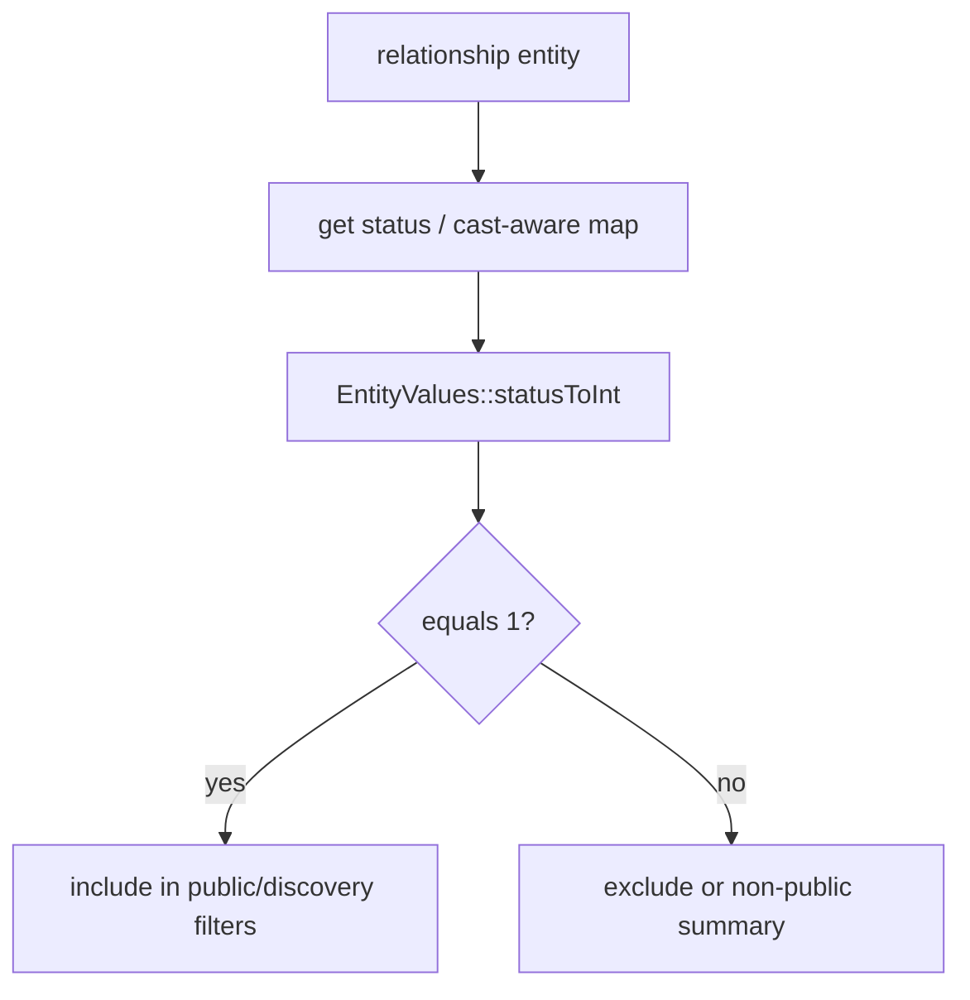

# Relationship Modeling (v0.6)

<!-- Spec reviewed 2026-07-03 - audit-remediation batch R5 (security): new `Waaseyaa\Relationship\RelationshipEndpointVisibilityPolicy` field-access policy closes the endpoint-identity leak on GET /api/relationship (collection+single), entity.read, and GraphQL — see new "Endpoint visibility (JSON:API / entity.read / GraphQL — field-access redaction, R5)" section. Registered via #[PolicyAttribute] + the two-phase AccessPolicyRegistry (SHARED boot path), so it wires on BOTH HttpKernel and ConsoleKernel — the ConsoleKernel path is load-bearing because entity.read runs under ai:run/queue:work; a HttpKernel-only configureHttpKernel() registration was rejected for exactly this reason. Two residuals documented, not fixed: (1) discovery/browse-API + SSR bypass the field-access plumbing (workflow-status-only VisibilityFilterInterface, not full AccessPolicyInterface); (2) both-endpoints-hidden still returns the edge with all four endpoint fields redacted (edge-existence metadata; closing it is entity-level, RelationshipAccessPolicy's job). No change to the existing traverse()/browse() publication-state gate. Acceptance: RelationshipEndpointVisibilityPolicyTest, RelationshipEndpointVisibilityRestTest, RelationshipEndpointVisibilityEntityReadTest, RelationshipEndpointVisibilityDiscoveryTest (boot-wiring guard — fails if reverted to configureHttpKernel); all RED against pre-fix wiring, GREEN after. -->
<!-- Spec reviewed 2026-07-01 - audit-remediation batch WP3 (security): (1) `RelationshipTraversalService::traverse()` now applies the SAME fail-closed endpoint-visibility gate as `browse()` — previously it returned raw `Relationship` entities filtered only by the relationship row's own `status`, leaking `to_entity_type`/`to_entity_id` of endpoints the viewer cannot see; see "Endpoint visibility" section. (2) `RelationshipDeleteGuardListener` generalized from hardcoded `'node'` to EVERY entity type and — for the first time — actually registered (RelationshipServiceProvider::boot() → EntityEvents::PRE_DELETE); see "Referential-Integrity Delete Guard" section. Adversarial-review follow-up same day: boot() resolves the dispatcher under the Symfony-contracts FQCN the kernel bus actually serves (foundation FQCN resolves null — the first cut silently registered nothing in a real boot); the guard matches endpoints by id OR uuid; traverse() with no filter wired returns no edges in unpublished mode too. Acceptance: RelationshipTraversalServiceTest::testTraversePublishedFailsClosedWithoutVisibilityFilter + testTraverseUnpublishedFailsClosedWithoutVisibilityFilter, RelationshipDeleteGuardListenerTest (incl. uuid-endpoint pin), RelationshipServiceProviderTest (bus stub mirrors the production key set). -->
<!-- Spec reviewed 2026-06-22 - WP06 (alpha245 security, audit #36): RelationshipTraversalService::isEntityPublic() defaulted to `true` when no VisibilityFilterInterface was wired, and BOTH live consumers (api DiscoveryApiHandler, ssr SsrPageHandler) built the service with no filter — so `browse()` in published mode leaked the labels/paths of related entities that are themselves unpublished to anonymous callers. The null default is now fail-CLOSED (`?? false`): an unwired filter withholds every related label/path. The two live consumers now pass `WorkflowVisibilityFilter`, so authorized published-content navigation is unchanged while drafts stay hidden. Traversal/discovery contract shapes unchanged. Acceptance: RelationshipTraversalServiceTest::testBrowsePublishedFailsClosedWithoutVisibilityFilter. Residual: the ai-agent `RelationshipTraverseTool` (separate audit item) returns raw edge values with no per-edge view check — tracked separately. -->
<!-- Spec reviewed 2026-06-04 - PR #1614 incidental: StubEntityTypeManager test fixture (packages/relationship/tests/Fixtures/) gained a stub `resolveFieldDefinitions(string $entityTypeId, ?string $bundle = null): array { return []; }` to satisfy the new bundle-aware `EntityTypeManagerInterface` method. No relationship contract or traversal semantic changed. -->
<!-- Spec reviewed 2026-05-19 - mission sql-entity-query-access-checking-01KRYP15 (#1495) incidental: `RelationshipValidator` and `RelationshipDeleteGuardListener` keep their `accessCheck(false)` bypass on internal integrity queries — gained inline justifications ("FK integrity check spans access boundaries; a user cannot be allowed to violate FKs because they cannot see the referenced entity"). Test fixtures `FixedResultEntityQuery` and `NullEntityQuery` got the new `EntityQueryInterface::setAccount()` method to satisfy the interface contract. No relationship contract or traversal semantic changed. -->
<!-- Spec reviewed 2026-05-12 - mission entity-storage-v2-01KRCDDC incidental: StubEntityTypeManager test fixture (packages/relationship/tests/Fixtures/) updated to satisfy new EntityTypeInterface::getPrimaryStorageBackend(): ?string method from WP07. No relationship contract or traversal semantic changed. -->
<!-- Spec reviewed 2026-05-02 - mission #1257 WP10 incidental: StubEntityTypeManager test fixture (packages/relationship/tests/Fixtures/) gained a stub `getTenancy(): ?array { return null; }` to satisfy the new EntityTypeInterface method. No relationship contract or traversal semantic changed. -->
<!-- Spec reviewed 2026-04-25 - Relationship entity: attribute-driven keys / constructor alignment only; traversal and discovery semantics unchanged -->
<!-- Spec reviewed 2026-04-24 - RelationshipTraversalService summary batching: numeric entity IDs normalized via filter_var(FILTER_VALIDATE_INT) instead of ctype_digit (PHP 8.4 deprecation); loadMultiple key resolution unchanged in intent -->
<!-- Spec reviewed 2026-04-11 - Relationship entity: widened constructor for duplicateInstance re-entry; modeling and traversal semantics unchanged (#alpha-119) -->
<!-- Spec reviewed 2026-04-11b - Package tests only: EntityTypeManagerInterface stubs implement getRepository() (#1128); no relationship domain change -->
<!-- Spec reviewed 2026-04-07 - RelationshipParameterValidator extracted from RelationshipDiscoveryService (579→442 lines); validation/normalization helpers in dedicated class, injected as constructor dependency; timelineSortDate converted to instance method for consistent injection -->
<!-- Spec reviewed 2026-04-09 - RelationshipTraversalService: combined relationship queries where applicable; timeline active-window predicates pushed into SQL; browse still merges/sorts hub/cluster slices in PHP with batched entity loads -->
<!-- Spec reviewed 2026-04-09k - traversal summaries, access policy, pre-save normalization, and discovery edge context use `EntityValues` / `get()` for cast-aware values (#1181 ST-8) -->
<!-- Spec reviewed 2026-04-09 ST-9 - status/visibility diagram + cast-aware invariants cross-link (#1181) -->

<!-- Spec reviewed 2026-04-20 - Package tests only: EntityTypeManagerInterface stubs now accept optional registrant provenance on registerEntityType/registerCoreEntityType; no relationship domain change (#1313) -->

## Decision

Relationships are modeled as **first-class entities**.

This is the canonical v0.6 design for Minoo and downstream AI/MCP traversal.

## Rationale

- Supports culturally rich many-to-many and directional links.
- Supports qualifiers and provenance per relationship.
- Works cleanly with semantic retrieval and MCP graph traversal.
- Avoids schema lock-in from embedded references.

## Entity Contract

Entity type: `relationship` (name subject to final bundle naming convention)

Required fields:

- `relationship_type`
- `from_entity_type`
- `from_entity_id`
- `to_entity_type`
- `to_entity_id`
- `directionality` (`directed` | `bidirectional`)
- `status`

Optional qualifiers:

- `weight` (numeric ranking hint)
- `start_date`
- `end_date`
- `confidence`
- `source_ref`
- `notes`

## Validation Contract

- **`Waaseyaa\Relationship\RelationshipParameterValidator`** — centralizes normalization and validation of relationship discovery inputs (filter shape, pagination limits, field allowlists) before `RelationshipDiscoveryService` runs graph reads, so the service stays orchestration-only.

- All required fields must be present.
- Endpoint entity references must resolve.
- `start_date <= end_date` when both are set.
- Duplicate-edge policy must be explicit (unique constraint or idempotent upsert).
- Self-link policy must be explicit by relationship type.

## Query/Traversal Contract

Traversal must support:

- direction filter (`outbound` | `inbound` | `both`)
- type filter (`relationship_type` in set)
- temporal filtering
- status visibility filtering

Implementation note: timeline-style browse applies temporal window constraints in SQL (overlap with `start_date` / `end_date`) where possible so PHP does not filter full edge sets only to discard them. Hub/cluster surfaces may still merge outbound and inbound slices before deterministic sort and pagination; facet totals should be interpreted with the cost/accuracy trade-offs documented on the issue/milestone for paged discovery.

Deterministic ordering contract:

- `status` visibility first
- `weight` descending
- `start_date` ascending
- stable tie-breaker by entity id

Visibility normalization invariant:

- Relationship/public discovery checks must use shared workflow/status normalization (`Waaseyaa\Workflows\WorkflowVisibility`) rather than per-surface custom logic, so `workflow_state` and fallback `status` semantics stay identical across SSR/search/MCP/relationship browse.

### Endpoint visibility (traverse and browse, fail-closed)

Both public read surfaces of `RelationshipTraversalService` gate on the *related endpoint's* publication visibility, not just the relationship row's own `status`:

- **`browse()`** — in `published` mode an edge is emitted only when the related endpoint is provably public via the wired `VisibilityFilterInterface`; `unpublished` mode inverts the check. With **no filter wired the service fails CLOSED** (`isEntityPublic()` → `false`): every related label/path is withheld (alpha245 fix, audit #36).
- **`traverse()`** — same contract since the 2026-07-01 WP3 fix, applied to the returned `Relationship` entities: in `published`/`unpublished` mode, EVERY non-source endpoint of a relationship must pass the visibility gate or the whole relationship is dropped. This is direction-independent and strictly at-least-as-closed as browse (a `Relationship` entity exposes both endpoint identities, so both are checked). Self-loops and empty endpoint slots expose nothing foreign and pass. The filter runs after the temporal/sort/limit step, matching browse's ordering (a limit can therefore return fewer visible rows than requested — browse parity). **With no filter wired, traverse() returns NO edges in BOTH modes** — a binary `is_public` cannot distinguish "provably draft" from "unknown", so unpublished mode fails fully closed rather than fail-open (adversarial-review hardening; this is deliberately stricter than browse's unwired unpublished mode, a pre-existing browse behavior left unchanged because both live browse consumers wire filters).
- **`status: 'all'`** performs NO endpoint filtering on either surface — callers opting into `all` own the exposure decision (system context). There is deliberately no separate unfiltered `@internal` traverse variant: `traverse(..., ['status' => 'all'])` already is the explicit system-context spelling, and no production consumer needed one (traverse had zero callers when the gate was added).
- Neither surface is per-ACCOUNT access-checked — visibility is publication-state (workflow/status) semantics, consistent with the anonymous public discovery API. The account-bound alternative (`getRepository('relationship')->getQuery()->setAccount(...)`, per-row `RelationshipAccessPolicy` view checks) is a materially different contract and was deliberately not adopted for these surfaces.
- Storage-shape caveat (pre-existing): the edge query in `queryRelationshipsForDirection()` is raw SQL against real `from_*`/`to_*`/`status` columns (the `RelationshipSchemaManager::ensure()` shape used by tests and apps). A generic kernel-boot `SqlSchemaHandler` table stores those fields in the `_data` blob, where the raw SQL cannot see them — this affects browse and traverse equally and predates WP3.

### Endpoint visibility (JSON:API / `entity.read` / GraphQL — field-access redaction, R5)

The gate above (`browse()`/`traverse()`) is publication-STATE based and per-surface, not per-account, and it does not run at all on the generic entity read paths: `GET /api/relationship` (collection + single), the MCP `entity.read` tool, and GraphQL's generic entity resolver all reach a relationship edge through the SAME shared `EntityAccessHandler` field-access plumbing every entity type uses (`ResourceSerializer::filterFields()`, `JsonApiController::checkFieldAccess()`, `AbstractAgentTool::applyFieldAccessFilter()`, `GraphQlAccessGuard::filterFields()`) — none of which is publication-state aware, and `RelationshipAccessPolicy::access()` only gates the edge's OWN `status`/permission, never the endpoint's. Audit-remediation batch 2026-07-03 R5 closed the resulting gap: a viewable-but-unrelated edge disclosed a hidden/unpublished/access-restricted endpoint's identity (`to_entity_type`/`to_entity_id` or `from_entity_type`/`from_entity_id`) to any baseline caller on those three paths.

- **`Waaseyaa\Relationship\RelationshipEndpointVisibilityPolicy`** — a FIELD-only access policy (implements both `AccessPolicyInterface`, neutral on every operation, and `FieldAccessPolicyInterface`). For `view` on a `Relationship` entity, `fieldAccess()` loads the named endpoint via `EntityTypeManagerInterface::getRepository($type)->find($id)` and delegates to `EntityAccessHandler::check($endpoint, 'view', $account)`; the endpoint's (type, id) pair is redacted together (never just one of the two) whenever that check is not `isAllowed()`. Fail-closed: an empty id/type, an unregistered entity type, or a failed load is treated as NOT viewable.
- **Per-account, not publication-state.** This is deliberately a materially different contract from `browse()`/`traverse()`'s workflow-status gate above — it delegates to the endpoint's REAL `AccessPolicyInterface` (any reason an entity is hidden from an account: unpublished, access-restricted, tenant-scoped, etc.), not just a binary `is_public` flag.
- **Registered via ATTRIBUTE DISCOVERY**, `#[PolicyAttribute(entityType: 'relationship')]` with a `(EntityTypeManagerInterface, EntityAccessHandler)` constructor — so the SHARED-boot `AccessPolicyRegistry` (`AbstractKernel::discoverAccessPolicies()`) wires it on BOTH the `HttpKernel` AND the `ConsoleKernel`. The `ConsoleKernel` path is load-bearing: `entity.read` has real ConsoleKernel production callers (`ai:run --inline`, `queue:work` → `RunAgentHandler`), so a HttpKernel-only registration (an earlier `RelationshipServiceProvider::configureHttpKernel()` cut — a hook `ConsoleKernel` never invokes) would leave `entity.read` leaking in CLI/queue contexts. The apparent discovery-time cycle (the policy needs the `EntityAccessHandler` to delegate to endpoint entities) is resolved by the registry's two-phase algorithm: constructors typed for `EntityAccessHandler` are DEFERRED to phase 2 and receive the phase-1 preliminary handler (`KernelPolicyDependencyResolver`); `EntityTypeManagerInterface` is resolved off the kernel-services bus. This mirrors `Waaseyaa\Engagement\EngagementAccessPolicy` / `Waaseyaa\Messaging\MessagingAccessPolicy` (both handler-needing attribute-discovered policies), and is FIELD-level (per-account, all edges) versus `Waaseyaa\Genealogy\GenealogyRelationshipAccessPolicy`'s entity-level, genealogy-edge-scoped policy. For a genealogy edge specifically, genealogy's entity-level denial already hides the whole edge when an endpoint is hidden, so this field policy is belt-and-suspenders there; for any other edge type it is the sole protection. A boot-wiring guard test (`RelationshipEndpointVisibilityDiscoveryTest`) asserts the attribute is present and that the real `AccessPolicyRegistry->discover()` produces a redacting handler without hand-adding the policy — it fails if anyone reverts to a `configureHttpKernel`-style registration.
- **Coverage by read path:** JSON:API collection/single, MCP `entity.read`, and GraphQL are all covered because they share `EntityAccessHandler::filterFields()`/`checkFieldAccess()`. **NOT covered (residual 1):** the discovery/browse API (`RelationshipTraversalService::browse()`/`traverse()`, `DiscoveryApiHandler`) and SSR's relationship-navigation context (`SsrPageHandler::buildRelationshipRenderContext()`) bypass this plumbing entirely and rely solely on the `VisibilityFilterInterface` gate documented above — which only understands workflow publish/unpublish status, not the full `AccessPolicyInterface` surface. A custom access-restricted endpoint that is not simply "unpublished" is a residual gap on those two paths; `relationship.traverse` (the ai-tools MCP tool) is unaffected either way since it already carries its own independent `canViewEndpoint()` fail-closed gate.
- **Both-endpoints-hidden edge-existence metadata (residual 2):** because this policy is strictly field-level, an edge whose viewing account can see NEITHER endpoint still surfaces (its id, `relationship_type`, `status`) with all four endpoint fields redacted — leaking "an edge of type X exists between two entities you cannot see" (no identity crosses, but a sensitive `relationship_type` can). Dropping the whole edge in that case is an ENTITY-level decision owned by `RelationshipAccessPolicy` (deliberately not modified in the R5 batch), so it is disclosed and pinned by `RelationshipEndpointVisibilityRestTest::both_endpoints_hidden_still_returns_the_edge_with_all_four_endpoint_fields_redacted`, not fixed here.

### Cast-aware status and traversal (#1181 ST-9)

Relationship edges carry `status` (and related flags) that may be stored as strings, ints, or bools, or as backed enums when entities define `$casts`. Framework code normalizes visibility using **`get('status')`** and **`EntityValues::statusToInt()`** — not raw `toArray()` slices — so enum-backed or string storage stays consistent.

**Invariants**

1. **`RelationshipAccessPolicy`** — uses `$entity->get('status')` + `EntityValues::statusToInt()` for access decisions.
2. **`RelationshipTraversalService` / discovery summaries** — endpoint `is_public` uses `EntityValues::toCastAwareMap($entity)` (or equivalent) when delegating to workflow/discovery visibility helpers.
3. **`RelationshipPreSaveListener`** — normalizes via `EntityValues::toCastAwareMap($event->entity)` before validation so validators see domain-shaped values where casts apply.

Full casting rules: `docs/specs/entity-system.md` (Casting & hydration architecture).

## Referential-Integrity Delete Guard

`RelationshipDeleteGuardListener` blocks deletion of any entity that is still referenced as a relationship endpoint, so deletes cannot silently orphan edge rows.

- **Scope: every entity type, both identifier forms.** Endpoints are free-form `(type, id)` pairs and `RelationshipValidator` accepts any registered entity type — and accepts a UUID in the id slot via its `entityExistsByUuid` fallback — so the guard matches the deleted entity's own `getEntityTypeId()` plus **id OR uuid** (`IN` condition) against `from_*` and `to_*` endpoint columns. (Until 2026-07-01 the guard was hardcoded to `'node'` — and was never registered at all, so it guarded nothing in production; the UUID form was added after adversarial review.)
- **Wiring:** `RelationshipServiceProvider::boot()` registers it on `EntityEvents::PRE_DELETE`. The dispatcher is resolved from the kernel-services bus under the **Symfony-contracts FQCN** (`Symfony\Contracts\EventDispatcher\EventDispatcherInterface`) and type-checked against the foundation contract — `ProviderRegistryKernelServices::get()` does NOT serve the foundation FQCN, and resolving it silently no-ops boot (adversarial review caught exactly this; pattern per `AuditServiceProvider::boot()`; `MediaServiceProvider`/`FieldServiceProvider` still carry the latent foundation-FQCN resolve — pre-existing, tracked separately). The throw (`RuntimeException` "Safe-delete blocked for {type} {id}: linked relationship IDs [...]") aborts `EntityRepository::delete()` before the row is removed. To delete a referenced entity, delete (or repoint) its relationships first; deleting a relationship entity itself is guarded only if it is in turn an endpoint of a meta-relationship.
- **Queries are system-context** — `getRepository('relationship')->getQuery()` with `accessCheck(false)` + inline justification (FK integrity spans access boundaries; a user cannot be allowed to orphan edges they cannot see). The entity-query path also makes the guard storage-shape tolerant: on a generic `_data`-blob relationship table the conditions compile to `json_extract()` instead of column references.
- **Known limits:** `deleteMany()` buffers lifecycle events until after commit (`UnitOfWork`), so only the single-`delete()` path is guarded. A blocked delete currently surfaces as a 500 through the API (mapping to 409 Conflict is an open follow-up). Cascade-delete semantics (auto-removing edges instead of blocking) were considered and deliberately not chosen — blocking is the fail-safe default.
- `RelationshipPreSaveListener` has the same historical wiring gap (exists, never registered) — still open, tracked separately.

## Indexing Requirements

Minimum indexes:

- (`from_entity_type`, `from_entity_id`, `status`)
- (`to_entity_type`, `to_entity_id`, `status`)
- (`relationship_type`, `status`)
- temporal index for (`start_date`, `end_date`) filtering

## Inverse Semantics

- Relationship types that have logical inverses must declare them.
- `bidirectional` relationships must not create infinite duplicate pairs.
- Traversal responses must represent inverse semantics predictably.

## API/MCP/AI Alignment

- JSON:API shape for relationship entities must be stable.
- MCP traversal tools must consume relationship entities directly.
- Semantic indexing may include relationship context fields where relevant.

## Discovery Surfaces Contract (v0.9)

Relationship traversal powers reusable discovery composition primitives:

- Topic hub aggregation: deterministic, paginated edge lists with facet counts.
- Cluster composition: grouped neighborhoods keyed by `relationship_type + related_entity_type`.
- Timeline navigation: temporal edge listing with `direction`, `from`, `to`, and `at` filters.
- Endpoint pages: public endpoint contract exposing directional/inverse edge metadata and relationship edge context.
- Public discovery route payloads must preserve deterministic ordering under identical fixture input.
- Traversal browse composition reuses an in-request related-entity summary cache keyed by `{entity_type}:{entity_id}` so repeated edges to the same endpoint do not trigger duplicate entity loads.
- Browse edge materialization warms that cache by grouping distinct referenced endpoint IDs per `related_entity_type` and calling `EntityRepository::findMany()` (via `EntityTypeManager::getRepository($type)`) once per type per directional pass (outbound vs inbound), instead of `find()` per edge, so query count scales with distinct endpoints per type rather than raw edge count.
- **`status` is account-gated at the HTTP boundary, not inside `browse()`.** Per the note above, `RelationshipTraversalService` itself performs no per-account check — `status: 'all'` is the explicit "system context, unfiltered" spelling (no endpoint-visibility filtering at all) and `status: 'unpublished'` surfaces draft edges. Both are privileged views, so `Waaseyaa\Api\Http\Router\DiscoveryRouter::resolveDiscoveryStatus()` clamps the requested `status` query param to `'published'` for any caller that is not `isAuthenticated() && hasPermission('administer nodes')` (mirrors `RelationshipAccessPolicy`'s own admin bypass) before it ever reaches `topicHub()`/`clusterPage()`/`timeline()`/`endpointPage()`/`relationshipEntityPage()`. Without this clamp an anonymous caller could pass `?status=all` (or `unpublished`) and receive unpublished/private related-entity identities and edge metadata (audit R2 WP2, 2026-07-02).

Deterministic ordering for hub/cluster composition:

- `relationship_type` ascending
- direction rank (`outbound` before `inbound`)
- `related_entity_type` ascending
- `related_entity_label` ascending (case-insensitive)
- stable tie-breaker by `related_entity_id`, then `relationship_id`

## Test Matrix

Unit:

- field validation and temporal constraints
- inverse/duplicate/self-link behavior
- deterministic ordering

Integration:

- multi-entity graph traversal (teachings/stories/clans/events)
- cycles and self-links
- status-filtered visibility

E2E/Contract:

- admin authoring of relationships
- MCP traversal contract coverage
- semantic regression corpus including relationship-aware queries

## Deterministic Fixtures

Fixture corpus must include:

- directed chain
- bidirectional pair
- cycle
- self-link edge case (allowed or forbidden by type)
- temporal-bounded relationship
- unpublished relationship
- mixed workflow node states (published/draft/archived) to verify visibility enforcement
- cross-bundle related targets for hub/cluster aggregation
- large-graph fanout set for traversal/discovery stress reads
- deterministic mutation scenarios for cache invalidation coverage

v0.9 adds shared framework fixtures in `tests/Support/WorkflowFixturePack.php`:

- `discoveryNodes()` for public/non-public node mixes with fixed timestamps.
- `discoveryRelationships()` for temporal + status-varied graph edges.
- `discoverySearchScenarios()` for stable query expectations.
- `performanceNodesLargeGraph()` and `performanceRelationshipsLargeGraph()` for high-fanout graph surfaces.
- `performanceTraversalScenarios()` and `performanceCacheInvalidationScenarios()` for perf/correctness scenario coverage.
- `corpusSnapshot()` and `corpusHash()` for deterministic hash regression gates.

Downstream integration suites consume this shared corpus directly (SSR/search/MCP/discovery) to avoid drift across package-level tests.

<!-- Last reviewed: 2026-03-30 — test file reorganization only, no spec changes needed -->

<!-- Spec reviewed 2026-05-17 - dead-code baseline reduction (#1493 / PR TBD): @api PHPDoc sweep on extension-point classes + WaaseyaaEntrypointProvider extended to recognize EntityBase/ContentEntityBase subclasses and their traits. No behavioural change. -->

<!-- Spec reviewed 2026-05-17 - dead-code Phase 3 Bucket 4: @api PHPDoc sweep on additional public-API classes. No behavioural change. -->
