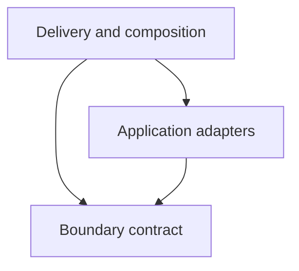

# waaseyaa/admin-surface

**Layer 6: Interfaces**

`waaseyaa/admin-surface` is the canonical integration boundary between a
Waaseyaa application and the Admin SPA. It translates authenticated HTTP
requests into domain-package operations, projects the results into a stable
wire contract, and serves the packaged SPA. It does not own entity storage,
authorization policy, workflow policy, revision storage, page-builder domain
behavior, or application-specific preview signing.

This charter is the package-level authority for ownership, composition seams,
internal dependency direction, and split-package contents. The wire-shape
authority is the concern-separated module set under `contract/`, re-exported
through `contract/index.ts`; `contract/README.md` describes how that
authority is maintained.

## Responsibilities and non-responsibilities

The package owns:

- canonical Admin Surface route and destination paths;
- route composition, transport status promotion, and SPA/static delivery;
- generic CRUD, list, action, revision, and page-builder adapters;
- the host-to-SPA result, session, catalog, entity, list, action, and
  page-builder payload contract;
- closed query, list-metadata, formatter, and action vocabularies;
- application composition ports for a custom host, publication projection,
  revision-preview grants, and page-builder hosting;
- the distributable Admin SPA tree and its manifest, marker, and signature
  evidence.

The package delegates authority to:

- `waaseyaa/access` for identity, principals, permissions, capabilities, and
  entity-access decisions;
- `waaseyaa/entity` and storage implementations for entity identity,
  persistence, mutation tokens, and revisions;
- `waaseyaa/api` and `waaseyaa/field` for schema projection and internal-field
  visibility;
- `waaseyaa/audit` for privileged publication-field read evidence;
- `waaseyaa/workflows` for bindings and transition decisions;
- `waaseyaa/page-builder` for drafts, commands, preview state, history, and
  restore behavior;
- applications for custom host composition and signed revision-preview URLs;
- `waaseyaa/routing` and `waaseyaa/foundation` for routing and provider
  lifecycle.

Generating an Admin destination or advertising a UI capability never grants
access. Every operation remains subject to the owning package's server-side
authority. Missing access services fail closed; missing field-schema authority
fails loudly during generic-host composition.

## HTTP boundary

`AdminSurfaceRoutePaths` is the PHP path authority. The SPA's relative route
builder in `packages/admin/app/runtime/adminSurfaceRoutes.ts` is a consumer that
must be checked mechanically against it.

| Route | Method and path | Transport gate | Handler and response contract |
| --- | --- | --- | --- |
| `admin_surface.session` | `GET /admin/_surface/session` | Session required | `handleSession`; compact `application/json`; valid refusal status promoted |
| `admin_surface.catalog` | `GET /admin/_surface/catalog` | Authentication required | `handleCatalog`; compact `application/json`; valid refusal status promoted |
| `admin_surface.list` | `GET /admin/_surface/{type}` | Authentication required | `handleList`; compact `application/json`; valid refusal status promoted |
| `admin_surface.get` | `GET /admin/_surface/{type}/{id}` | Authentication required | `handleGet`; compact `application/json`; valid refusal status promoted |
| `admin_surface.action` | `POST /admin/_surface/{type}/action/{action}` | Authentication and CSRF required | `handleAction`; JSON object body; compact `application/json`; valid refusal status promoted |
| `admin_surface.page_builder.definitions` | `GET /admin/_surface/page-builder/{surface}/definitions` | Authentication required | Optional page-builder host; dispatcher JSON response; valid refusal status promoted |
| `admin_surface.page_builder.draft` | `GET /admin/_surface/page-builder/{surface}/{id}` | Authentication required | Optional page-builder host; dispatcher JSON response; valid refusal status promoted |
| `admin_surface.page_builder.command` | `POST /admin/_surface/page-builder/{surface}/{id}/commands` | Authentication and CSRF required | Optional page-builder host; dispatcher JSON response; valid refusal status promoted |
| `admin_surface.page_builder.preview` | `POST /admin/_surface/page-builder/{surface}/{id}/preview` | Authentication and CSRF required | Optional page-builder host; dispatcher JSON response; valid refusal status promoted |
| `admin_surface.page_builder.history` | `GET /admin/_surface/page-builder/{surface}/{id}/revisions` | Authentication required | Optional page-builder host; dispatcher JSON response; valid refusal status promoted |
| `admin_surface.page_builder.revision` | `GET /admin/_surface/page-builder/{surface}/{id}/revisions/{revision}` | Authentication required; positive-integer revision | Optional page-builder host; dispatcher JSON response; valid refusal status promoted |
| `admin_surface.page_builder.restore` | `POST /admin/_surface/page-builder/{surface}/{id}/restore` | Authentication and CSRF required | Optional page-builder host; dispatcher JSON response; valid refusal status promoted |
| `admin_spa` | `GET /admin/{path}` | Public shell route | App static override, packaged static asset, packaged index, then fallback HTML; excludes `_surface` and `api` |

The five core handlers return the flat `{ok, data, error, meta}` Admin Surface
envelope. A refusal status is promoted to HTTP only when `ok` is exactly false
and `error.status` is an integer from 400 through 599. Page-builder routes keep
the routing dispatcher's existing encoding and wrap only valid refusal statuses
in its `statusCode`/`body` transport form.

`AdminDestinationPaths` owns links into the SPA for list, filtered list, create,
edit, record history, workflow pipeline, embedded create/edit, and embedded
page-builder views. It is a URL generator, not an access-decision API.

## Wire contract and consumers

The convergence target is one package-owned, concern-separated TypeScript contract:

| Concern | Canonical owner | PHP producer | SPA consumer |
| --- | --- | --- | --- |
| Result/error, session, catalog, entity, mutation token, list, CRUD | `contract/types.ts` | core DTOs/builders and `GenericAdminSurfaceHost` | bootstrap and transport adapters |
| JSON Schema request and response | `contract/schema.ts` | `SchemaController`/`SchemaPresenter` through the generic host | schema composables, forms, and listings |
| Entity history, revision, preview, and restore | `contract/revisions.ts` | generic host and preview authority | revision recovery workspace |
| Page-builder definitions, draft, commands, preview, history, revision, restore | `contract/pageBuilder.ts` | `GenericPageBuilderSurfaceHost` | mechanically checked `app/contracts/pageBuilder.ts`, client, composable, workspace |

The convergence slice resolves the known contract drift without changing the
wire protocol:

- `AdminSurfaceEntity.mutation_token` is canonical, required, and nullable,
  matching the PHP emitter's always-present key and the SPA's fenced writes.
- session fields match the PHP emitter's actual required/nullability behavior,
  and catalog capability optionality is exact.
- core CRUD, schema, revision, and page-builder crossing payloads are owned by
  the corresponding concern modules and re-exported through one entrypoint.
- `npm run check:contract-compatibility` uses exact TypeScript equality to
  prevent the SPA-local declaration-build mirrors from drifting silently.
- `AdminSurfaceContract.ts` and `ADMIN_SURFACE_VERSION` have no observed runtime
  consumer. They remain deprecated source-compatibility exports, are not wire
  authorities, and have their completion-or-removal lifecycle tracked in #3084.

Protocol keys are preserved exactly. Most payload fields are camelCase, while
the established concurrency and action protocol intentionally uses
`mutation_token` and related snake-case request keys. Consumers must not rename
those wire keys.

## Composition seams and optional dependencies

| Seam or dependency | Disposition | Composition behavior |
| --- | --- | --- |
| `AdminSurfaceHostFactoryInterface` | Public application extension | One optional application binding replaces the generic host while retaining canonical routes and transport behavior. |
| `AbstractAdminSurfaceHost` | Public application extension base | Custom hosts implement session, catalog, entity, list, and action operations behind the canonical HTTP boundary. |
| `SurfaceActionHandlerInterface` | Public application extension | Supplies a custom action implementation to a host. |
| `AdminPublicationFieldReaderInterface` | Public override seam with Framework default | Provider binds the audited implementation; applications may replace the projection boundary. |
| `BatchAdminPublicationFieldReaderInterface` | Public optional optimization seam | Preserves list cardinality while projecting already-authorized rows transactionally. |
| `AdminRevisionPreviewAuthorityInterface` | Public optional authority seam | Applications issue signed exact-revision preview grants after record, revision, and view checks. Absence disables preview issuance. |
| `PageBuilderSurfaceHostInterface` | Public optional route seam | Its presence registers all seven page-builder routes; absence registers none. |
| `GenericPageBuilderSurfaceHost` | Public Framework implementation | Generated applications bind it to the page-builder registry and gateways. |
| MCP package | Optional feature detection | `class_exists` enables only the declared MCP feature and capability allowlist; no hard Composer dependency. |
| Wayfinding package | Optional feature detection | `class_exists` enables only the declared Wayfinding session feature; no hard Composer dependency. |
| Field schema authority | Required generic-host dependency | Uses `FieldSchemaAuthority` or builds it from `FieldTypeManagerInterface`; absence throws. |
| Entity access handler | Required for useful generic access, fail closed | Reuses the kernel-composed handler; absence denies and filters rather than bypassing checks. |

The CLI governed-authoring recipe is the observed generated-application
composition site for `PageBuilderSurfaceHostInterface` to
`GenericPageBuilderSurfaceHost`. Generated-owner admission work remains in
issue #3073 and is not absorbed by this package charter.

## Internal dependency model

Every production PHP token belongs to exactly one internal layer. Dependencies
may point down this diagram, never upward. Same-layer dependencies are allowed.

- **Boundary contract** contains public ports, immutable crossing values,
  declarations, closed vocabularies, path authorities, and boundary parsers.
  It must not depend on either package implementation layer.
- **Application adapters** coordinate domain authorities and project their
  outcomes into the boundary contract. They may depend on Boundary contract,
  never Delivery and composition.
- **Delivery and composition** owns providers, route wiring, transport
  adaptation, static delivery, and fallback HTML. It may depend on both lower
  layers.

Deptrac is the enforcement authority for this model. Its configuration must
classify every production PHP token, report uncovered dependencies as failures,
and generate the maintained dependency view. This charter describes the
intended model; the scoped Deptrac work makes it executable.

The executable authority is `deptrac.yaml`; `dependency-graph.mmd` is its
generated evidence view. Run `composer check-admin-surface-deptrac` to enforce
the model and `composer admin-surface-dependency-view` to refresh the view.

### Complete production-token classification

| Layer | Production PHP token | Role |
| --- | --- | --- |
| Boundary contract | `Action/SurfaceActionHandlerInterface.php` | Custom action port |
| Boundary contract | `AdminDestinationPaths.php` | SPA destination-path authority |
| Boundary contract | `AdminSurfaceRoutePaths.php` | Admin HTTP path authority |
| Boundary contract | `Catalog/ActionDefinition.php` | Catalog action value |
| Boundary contract | `Catalog/CatalogBuilder.php` | Catalog declaration builder |
| Boundary contract | `Catalog/EntityDefinition.php` | Catalog entity declaration |
| Boundary contract | `Catalog/FieldDefinition.php` | Catalog field value |
| Boundary contract | `Host/AdminPublicationFieldReaderInterface.php` | Publication projection port |
| Boundary contract | `Host/AdminRevisionPreviewAuthorityInterface.php` | Revision-preview authority port |
| Boundary contract | `Host/AdminRevisionPreviewGrantData.php` | Revision-preview grant value |
| Boundary contract | `Host/AdminSurfaceHostFactoryInterface.php` | Application host factory port |
| Boundary contract | `Host/AdminSurfaceResultData.php` | Result and refusal envelope value |
| Boundary contract | `Host/AdminSurfaceSessionData.php` | Session payload value |
| Boundary contract | `Host/AdminSurfaceUiPayload.php` | Session UI payload value |
| Boundary contract | `Host/BatchAdminPublicationFieldReaderInterface.php` | Batch publication projection port |
| Boundary contract | `List/ListFormatter.php` | Closed list formatter vocabulary |
| Boundary contract | `List/ListMetadata.php` | Validated list metadata value |
| Boundary contract | `PageBuilder/PageBuilderSurfaceHostInterface.php` | Optional page-builder route port |
| Boundary contract | `PageBuilder/PageBuilderSurfaceRequest.php` | Principal and body request value |
| Boundary contract | `Query/SurfaceFieldName.php` | Closed field-name grammar |
| Boundary contract | `Query/SurfaceFilterOperator.php` | Closed filter-operator vocabulary |
| Boundary contract | `Query/SurfaceQuery.php` | Parsed list query value |
| Boundary contract | `Query/SurfaceQueryParser.php` | HTTP query boundary parser |
| Boundary contract | `Host/AbstractAdminSurfaceHost.php` | Public host operation and request orchestration base |
| Application adapters | `Host/AuditedAdminPublicationFieldReader.php` | Audited publication projection adapter |
| Application adapters | `Host/GenericAdminSurfaceHost.php` | Generic entity CRUD, list, action, and revision adapter |
| Application adapters | `List/SurfaceQueryPolicy.php` | Server-side enforcement of list declarations |
| Application adapters | `PageBuilder/GenericPageBuilderSurfaceHost.php` | Page-builder domain-to-wire adapter |
| Delivery and composition | `AdminSpaFallback.php` | Safe fallback HTML response |
| Delivery and composition | `AdminSurfaceServiceProvider.php` | Service composition, routes, transport, and static delivery |

## Public-interface dispositions

`public-surface.php` remains the editable compatibility authority. This
candidate reconciles its 24 entries with the dispositions below. Concrete
Framework implementations are declared only when they are supported
composition surfaces; internal implementations do not gain compatibility
status from dead-code annotations.

| Symbol or family | Disposition | Lifecycle |
| --- | --- | --- |
| `SurfaceActionHandlerInterface` | Public | Supported custom-action port |
| `AbstractAdminSurfaceHost` | Public | Supported custom-host base |
| `AdminSurfaceHostFactoryInterface` | Public | Supported application composition port |
| `AdminPublicationFieldReaderInterface` | Public | Supported application override port |
| `BatchAdminPublicationFieldReaderInterface` | Public | Supported optional batch extension |
| `AdminRevisionPreviewAuthorityInterface` | Public | Supported optional application authority |
| `PageBuilderSurfaceHostInterface` | Public | Supported optional route-composition port |
| `ListFormatter` | Public | Closed, additive formatter vocabulary |
| `SurfaceFilterOperator` | Public | Closed, additive query vocabulary |
| `AdminDestinationPaths`, `AdminSurfaceRoutePaths` | Public | Supported URL/path authorities |
| `CatalogBuilder`, `EntityDefinition`, `FieldDefinition`, `ActionDefinition` | Public | Supported catalog construction API returned through the custom-host base |
| `AdminSurfaceSessionData`, `AdminSurfaceResultData`, `SurfaceQuery` | Public crossing values | Supported parameter and return types of the custom-host base |
| `ListMetadata`, `SurfaceQueryPolicy` | Public | Supported declaration and enforcement pair |
| `AdminRevisionPreviewGrantData`, `AdminSurfaceUiPayload` | Public crossing values | Supported values returned or constructed through public seams |
| `PageBuilderSurfaceRequest` | Public crossing value | Supported parameter of the public page-builder host port |
| `GenericPageBuilderSurfaceHost` | Public Framework implementation | Supported default for generated/app composition |
| `AdminSurfaceServiceProvider`, `AdminSpaFallback`, `GenericAdminSurfaceHost`, `AuditedAdminPublicationFieldReader`, `SurfaceQueryParser`, `SurfaceFieldName` | Internal | Framework implementation or composition detail; no direct compatibility promise beyond public routes and ports |

The legacy TypeScript aggregate `AdminSurfaceContract` and marker
`ADMIN_SURFACE_VERSION` are deprecated compatibility exports. They have no
observed runtime consumer and do not define payload authority; #3084 owns their
completion or removal.

## Split-package contract

The repository split workflow publishes `packages/admin-surface` to the
`waaseyaa/admin-surface` repository. The split must contain, at minimum:

- `composer.json`, `src/`, `public-surface.php`, package tests,
  `deptrac.yaml`, and the generated `dependency-graph.mmd` view;
- the authoritative `contract/` TypeScript sources and documentation;
- the built `dist/` tree plus `dist.manifest.json`, `dist.markers.json`, and
  `dist.signature`;
- the package README and other files admitted by distribution checks.

`tests/PackagedForm/split-artifact-acceptance.php` is the repository acceptance
boundary for the isolated artifact. A passing monorepo test that relies on
undeclared root files or dependencies is not sufficient split-package evidence.

## Change discipline

Changes to this package must include discriminating evidence at the affected
boundary: package PHP tests, canonical-to-SPA TypeScript compatibility, route
composition, crossing-payload conformance, Deptrac, distribution acceptance,
and browser coverage when behavior visible to an operator changes. Required
hooks and hosted checks remain mandatory.

Large extraction of `GenericAdminSurfaceHost` or
`AdminSurfaceServiceProvider` remains in #3082 and #3083 respectively.
Generated-owner admission from issue #3073 and required identifier validation
from issue #3023 remain independently scoped.
